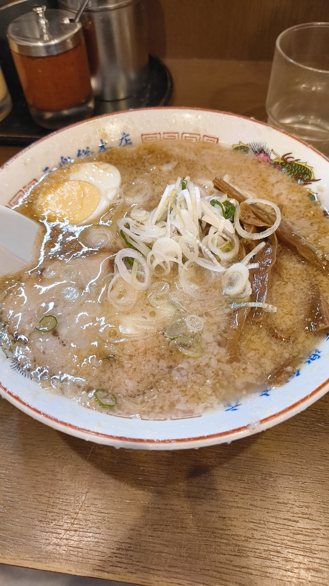
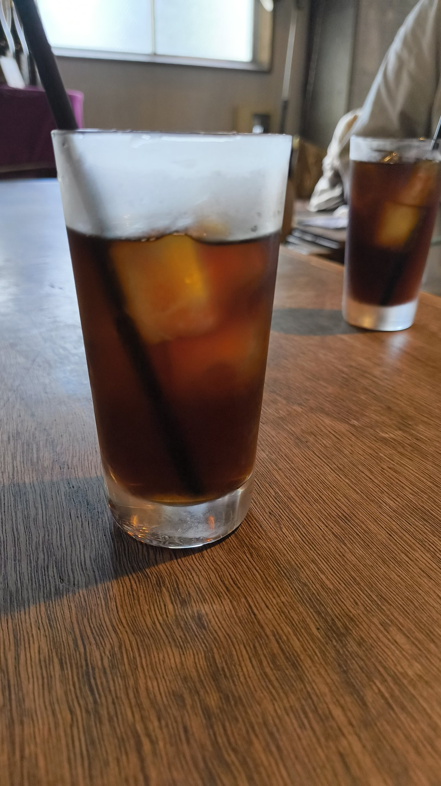
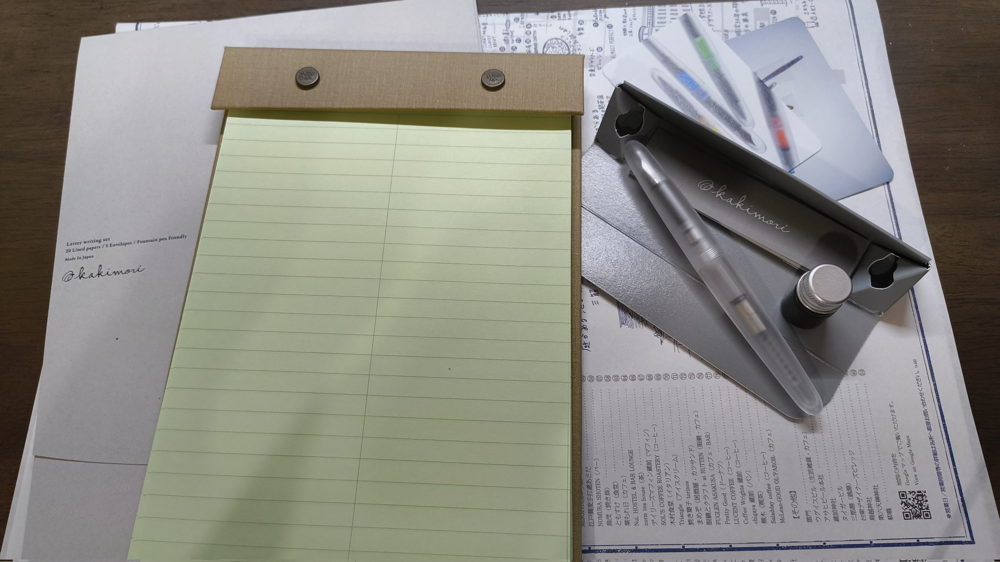
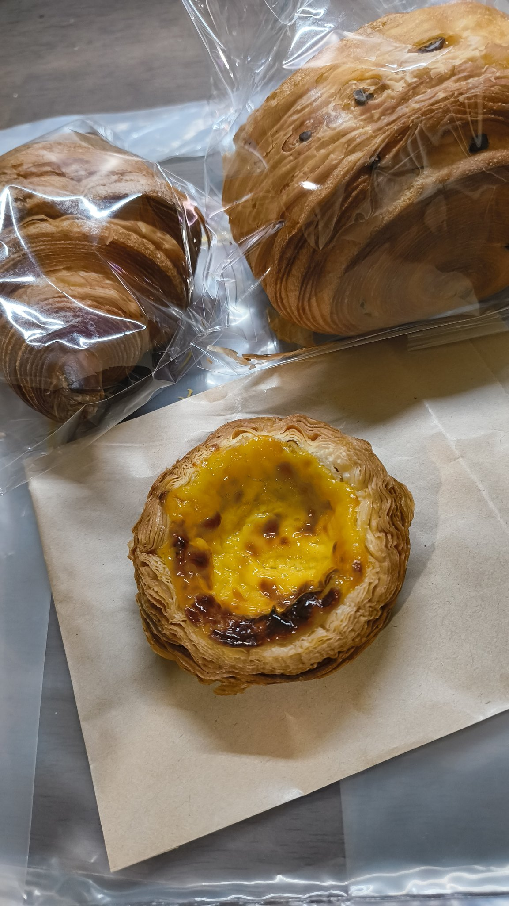

## 蔵前に行ってきた
浅草の隣駅、蔵前に行った。
蔵前はカキモリという自分が一番好きな文具店がある。

### お昼はラーメンとコーヒー
同僚と元楽で合流した。自分はいつも通り元ラーメンを食べた。

そのあとは、自分がコーヒーが飲みたい気分だったので、nuiというカフェに行き、アイスコーヒーを飲んだ。

### カキモリ
カキモリでは、新商品の万年筆を試した。ローラーボールと互換性があるので、ペン先をローラーボールに変更することもできるようだった。
書き心地、cocoonのようなフォルム、スモーククリアな外装に惚れて、買ってしまった。
購入特典として、ミニインクのガチャガチャを回した。すでにもっているmukuriという色が当たった。

万年筆はMを買った。ヌラヌラかけた。

### シノノメ製パン
そのあとは、シノノメ製パンでパンを買った。
店内に充満するパンの香りがとてもよかった。

家に帰ってから、エッグタルトを食べたが、パリパリサクサクで美味しかった。

### おしゃれなインテリアを求めて
家具屋の「NOCE」という、生活用品店の「道具屋のぼり」を巡った。
NOCEではたくさんのソファが並んでいた。試しに座ったら今使っているソファよりも良かったので買い替えたくなった。コーヒーテーブルも欲しくなった。

道具屋のぼりでは、食器やフレグランスを見ていた。
たくさんのお香を嗅いで、最終的にAPFRのwhite teaのお香を買った。
一緒に来ていた同僚も、これを機にお香を買っていたので嬉しかった。

金属製でワイングラスのような足がある、アイスクリームカップを売っていたが、流石に勇気がでなかったので買わなかった。

## 終わりに

普段行かないお店を多く行けて楽しかった。そろそろラーメン以外の選択肢を増やしたい
