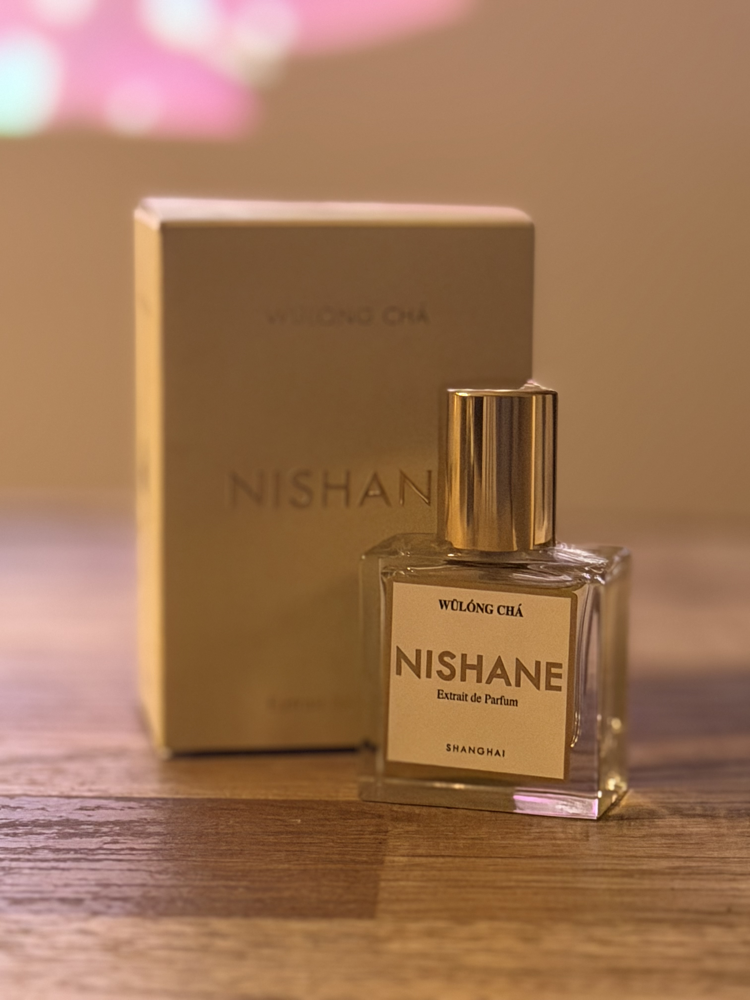
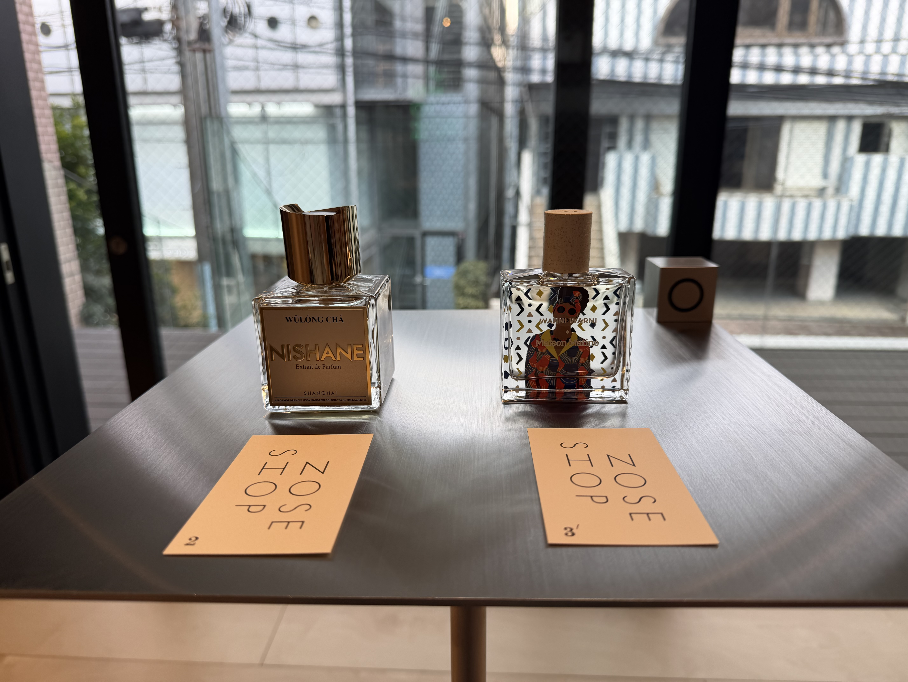
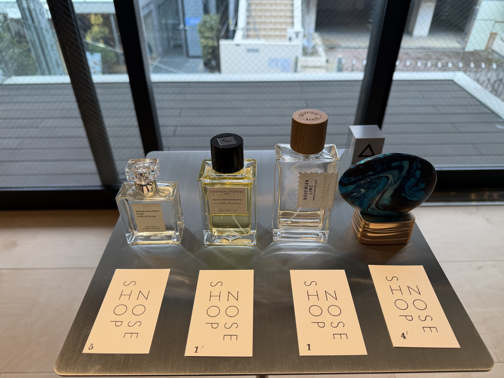
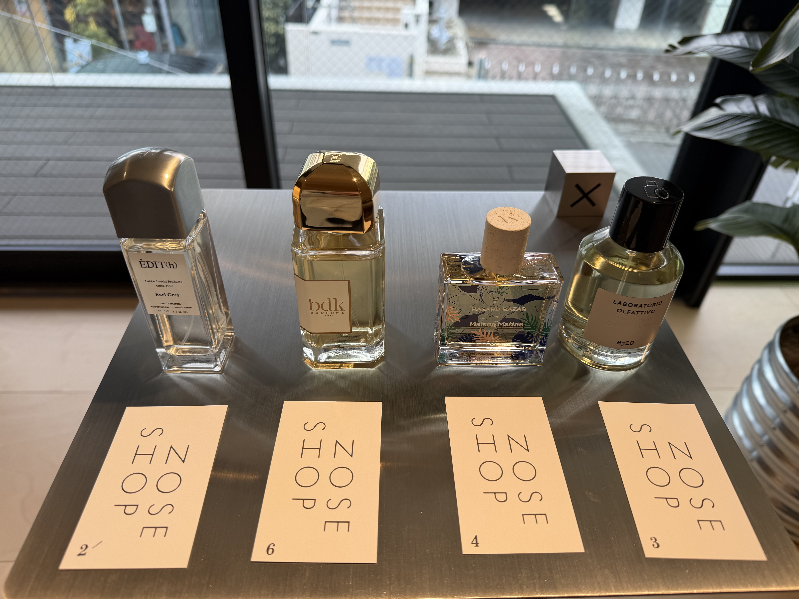

1月9日にオープンした[NOSH SHOP SALON](https://noseshop.jp/blogs/blog/noseshop-salon-open)で、香水カウンセリングを受けてきた。

## 友人2人とワイワイしながらカウンセリングを受けた

友人2人と一緒にカウンセリングを受けに行った。
カウンリングを受けれるのは1組あたり1人までであるた、自分が受けた。

どんな場面でつけたいか、何のためにつけたいのか、カウンセリングで知りたいことなどを伝えた。
今回は、

- 職場にもつけていけるような日常使い
- 好印象にみられる
- 気分の切り替えになる

といった香水で、

- 好きな香水の方向性を探す

が目標だった。

その後は、パッケージを見ずに、6つの香水をムエットを嗅ぎながら、
良かったところ、悪かったところなどを感想を言いながら、どういう香水が好みか探っていった。

そして、好みに香水に対してより深掘りを行い、好きだと感じた要素がある、香水を追加で4つピックアップしてもらった。
それらの香水も嗅ぎながら、同じように感想を言いながら評価をした、

最終的に10種類の香水の順番を決めて、最後にパッケージとどんな香水か説明を受けた。

最後に実際につけてみて、匂いを確認した。
友人にも匂いを嗅いでもらい、好評で良かった。

## 最終的な香水カウンセリングの結果

### 香水の好み
- 好き : お茶系、好印象、温かい香り
- 嫌い : さわやかすぎる香り、甘すぎる香り、冷たい香り

### 今日の香水ベスト3
1: [NISHANE -　ウーロンチャ](https://noseshop.jp/collections/nishane/products/146371131)
2: [Maison Matine - ワルニ ワルニ](https://noseshop.jp/products/160822816)
3: [Maison Louis Marie - No.9](https://noseshop.jp/products/139871324)

### シアージュ(香りの余韻)
すっと、ふわっと、しっかりの3タイプから自分が良いと思った香水は「ふわっと」だった。

### NOSE SHOP 宮下パーク店で改めて香水を見て購入
SALONで購入すると、カウンセリング料金2,200円分を値引きしてもらえるのだが、もう少し吟味したかったので、改めてNOSE SHOP 宮下パーク店で他に色々試して、香水を見て購入することにした。

結局、カウンセリングで一位になった香水を購入した。
甘すぎず爽やかすぎずの紅茶のような香りが良くて気に入った。　

[NISHANE -　ウーロンチャ](https://noseshop.jp/collections/nishane/products/146371131)

## ランキング
10種類の香水を自分なりに評価したので以下乗せておく。
右から良かった順です。

## お茶系が好みだとは思わなかった

ウッディが好きかと思っていたが、意外とお茶系が好みだということがわかった。
カウンセリングも話しやすい雰囲気で楽しく、カウンセリングを受けることができた。

無理に購入も勧められなかったので、香水何もわからないという入門にぴったりだった。
