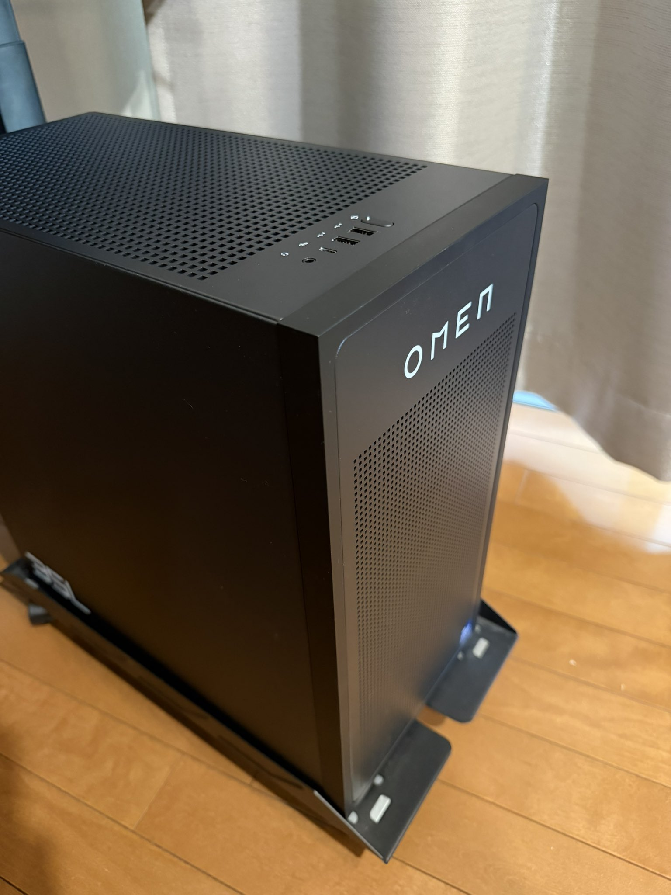

[以前、ゲーミングPCを自作した](/posts/2023-06-29)のだが、またPCを買い替えた。

## きっかけ

前回組んだ自作PC、スペック的には満足していた。最近ゲーム中に落ちることが頻繁にあった。
約3年使っているので、思い切って買い替えることにした。

## 今回はBTO

前回は自作だったけど、今回はBTOにした。
BTOパソコンにこまかなカスタマイズはできないので、デザインで選んだ。

## OMEN by HP 35L Gaming Desktop

| パーツ | スペック |
| --- | --- |
| CPU | Intel Core i7-14700F (最大5.40GHz / 20コア・28スレッド) |
| GPU | NVIDIA GeForce RTX 5070 Ti |
| メモリ | 32GB (16GB×2) DDR5 4400MT/s |
| SSD | 2TB PCIe Gen4 NVMe M.2 |
| Wi-Fi | Wi-Fi 7 (IEEE 802.11be) / Bluetooth 5.4 |
| OS | Windows 11 Pro |

前回との比較はこんな感じ。

| パーツ | 前回 (2023・自作) | 今回 (2026・BTO) |
| --- | --- | --- |
| CPU | Core i7-13700K | Core i7-14700F |
| GPU | RTX 4070 | RTX 5070 Ti |
| メモリ | 32GB DDR5 | 32GB DDR5 4400MT/s |
| SSD | 2TB (SAMSUNG 980 PRO) | 2TB PCIe Gen4 NVMe |
| ケース | Fractal Design North | OMEN 35L |
| 価格 | 約30万円 | 約40万円 |

お値段はセール価格で約40万円。前回の自作PCが30万だったので、10万上がったが性能も上げたので気にしない。

自作のパーツ悩んで、組み立てる時間も楽しいが。届いて設置して使えるBTOは楽だなと改めて実感した。

## デザインが良い

このOMEN 35LはシンプルなデザインでゲーミングPC特有のRGBライティングがない。ガラスサイドパネルもなしのシャドウブラック。
部屋に置いても主張がなくて嬉しい。
以前のゲーミングPCもガラスパネルなし、極力RGBライティングを減らしていたがGPUだけが光っていた。
今回は光らないのでうれしい。

## 開発環境構築

以前と比べて開発環境も変わってきていて、私用のMacに近づけるために、
wsl+goshtty+zshの環境をにした。

WSLのGUIアプリ(WSLg)で日本語が使えない問題にもハマった。ロケール設定やfcitx5+Mozcの導入など、[この記事](https://zenn.dev/masinc/articles/464bea11f2d47e)を参考に対応した。
