## はじめに

2025年の8月ぐらいに海外に行きたいと思い立ち、パスポートを取った。
そして、2026年の3月6日〜3月9日に3泊4日の韓国旅行をした。

## 旅行前に準備したこと

### 空港

ソウルへ向かう空港は、金浦空港（GMP）と仁川国際空港（ICN）がある。
金浦空港は市内に近く、ソウル駅まで電車で約20分。
仁川国際空港からソウル駅までは一般列車で約60分、空港鉄道の直通列車で約40分かかる。

今回は、移動時間の短い金浦空港を利用した。

### 決済手段

韓国ではJCBとMastercardに対応した店が多かった。
カード1枚だけに依存せず、異なるブランドと少額の現金を用意した。

海外でクレジットカードを使う場合、カード会社の基準レートに海外事務手数料が加算される。
2026年7月20日時点で確認した手数料は次のとおり。

| カード | 海外事務手数料 |
| --- | ---: |
| [JCB W](https://j-faq.jcb.co.jp/faq/show/412?site_domain=default) | 1.60% |
| [三井住友カード](https://www.smbc-card.com/mem/service/sec/kaigai01.jsp)（Visa、Mastercard） | 3.63% |
| [楽天カード](https://www.rakuten-card.co.jp/overseas/payment/) | 3.63% |

カードの換算日は実際の利用日と異なるため、上の数字だけで最終的な支払額は決まらない。
それでも、カードを選ぶときの比較材料にはなる。

WOWPASSの外貨現金チャージも、市場レートとの差を確認した。
WOWPASSが100円で898ウォン、市場レートが100円で912.37ウォンだった場合、受取額の差は次のようになる。

> （912.37 - 898）÷ 912.37 × 100 = 約1.58%

この条件では、WOWPASSのチャージレートに含まれる実質的なコストは約1.6%だった。
為替とチャージレートは変動するため、利用する日に[WOWPASS](https://www.wowpass.io/ja)アプリで確認する。

物理カードを増やしたくない場合は、[Mobile T-money](https://www.funliday.com/posts/k-t-money/)も選択肢になる。
対応端末と登録条件は日本にいるうちに確認しておく。

### 現地で使うアプリ

必要なアプリは日本にいるうちに会員登録とログインを済ませた。
現地でSMS認証が必要になると、移動中に使い始められない可能性がある。

- [NAVER Map](https://apps.apple.com/jp/app/naver-maps-navigation/id311867728)：韓国内の経路検索に使う。Google Mapsでは経路検索が十分でない場面がある
- [k.ride](https://apps.apple.com/jp/app/k-ride-taxi-cab-travel/id6474654222)：Kakao Tの旅行者向けタクシーアプリ

### ソウルのエリア

旅行前は、東京の街に置き換えて各エリアの雰囲気を整理した。

- 明洞：渋谷。カフェ、アパレル、食事をまとめて見て回れる
- 梨泰院：新宿。バーやクラブが多く、夜まで人が集まる
- 聖水：表参道。アパレル、カフェ、雑貨店が集まる
- ソウル駅：東京駅。駅構内と周辺に店が多く、移動と買い物をまとめやすい

## スケジュール
- 3月6日：20時に羽田空港を出発し、22時に金浦空港へ到着。23時ごろ明洞のホテルにチェックインして、周辺の飲食店で韓国料理を食べる
- 3月7日：明洞、ソウル駅周辺を散策
- 3月8日：聖水と梨泰院を散策し、パラダイスカジノに行く
- 3月9日：東大門デザインプラザと明洞周辺を散策。20時に金浦空港を出発し、21時30分に羽田空港へ到着

## 20時:初めての国際線
国際線だったので、機内食が出た。ビーフオアチキンと聞かれることもなく親子丼が出てきた。
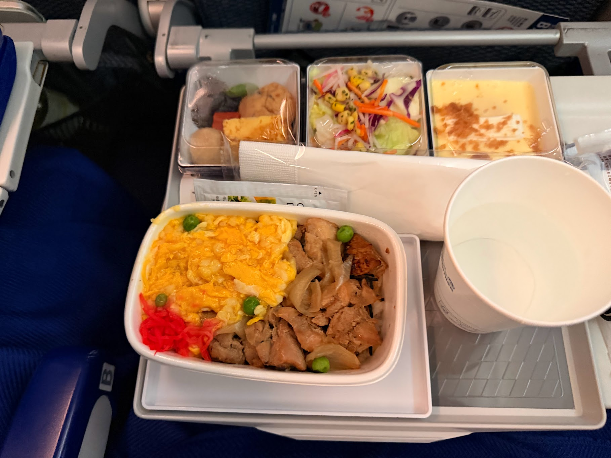

## 1日目

### 22時:空港からホテルへ
空港からは5号線と呼ばれる紫の電車に乗って、ホテル近くの駅まで移動した。

### wowpassが便利
空港最寄りの駅に移動する最中で、wowpass(交通系ICとプリペイドカードのハイブリッド的なカード)にお金をチャージした。

wowpassは日本円でウォンとしてチャージできて、為替レートも優遇されているので今回の旅行では基本wowpassを使うことになった。

機械の故障でwowpassの発行ができないなどのトラブルに遭っている方がいたので、wowpassはQoo10で事前購入して物理カードを持っていくのが良さそうだった。空港近くはwowpassの機械に多くの人が並んでいるので、手数料はかかるがアプリからチャージして、ソウルや明洞などに移動する分だけは事前にチャージしておくとスムーズそうだった。

### 23時:ホテルにチェックイン、周辺散策

[ホテル スカイパーク セントラル 明洞](https://hotels.his-j.com/HotelDetail/SEL00424.aspx)に3泊4日で宿泊した。

日本語が話せるスタッフもいたので良かった。
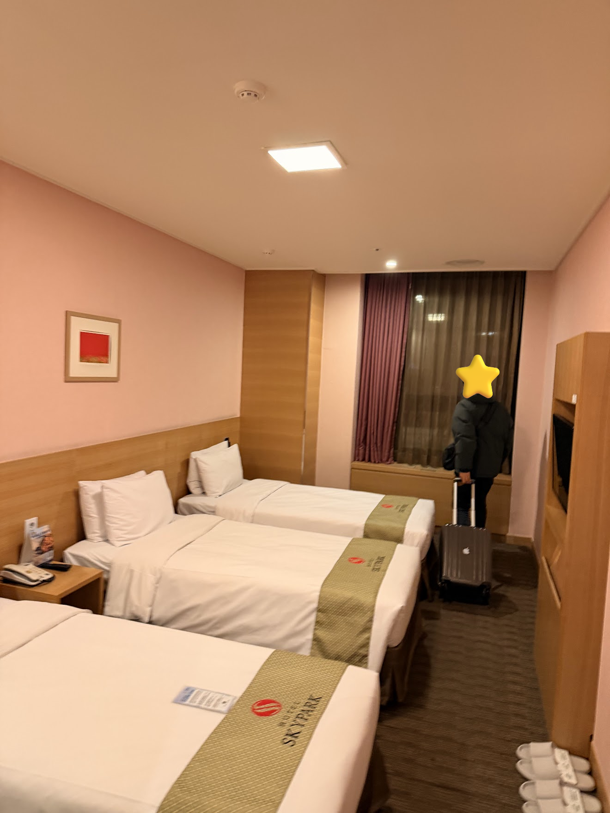

#### 周辺散策
時間が遅かったのでホテル周辺を散策した。

[tanttara Odeng](https://maps.app.goo.gl/JX6VqvftLvHxrMBL9)というお店で、チヂミ[^chijimi]や冷麺などを食べた。

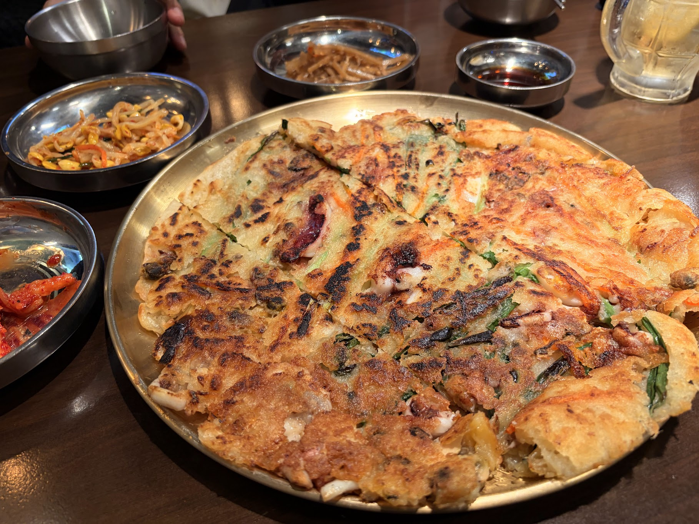

そのあとは、コンビニでヨーグルトなどを買ってホテルに戻った。

## 2日目 明洞ーソウル散策

### 朝ごはんはHOLLYSで
ホテルの朝食はなしにしていたので、歩きながら見つけたカフェHOLLYSで朝ごはんを食べた。
店内は広く、余裕もあり落ち着いた雰囲気だった。
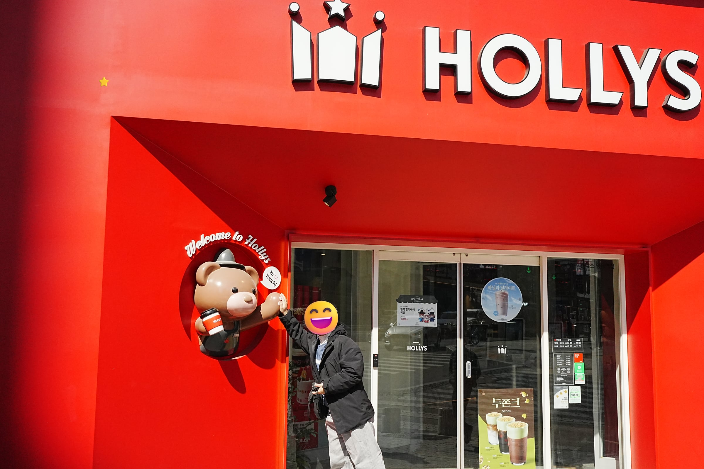

### 明洞からソウル駅へ歩く
そのあとは、明洞からソウル駅まで散策をした。
南大門市場でさまざまなお店が並んでいるを見た。南大門を通り、そのままソウル駅まで向かった。

ソウル駅では、お昼ご飯に[李陶コムタン ソウル駅直営店](https://www.konest.com/contents/gourmet_mise_detail.html?id=34604)でコムタン[^gomtang]を食べた。
様々な飲食店があったが、このお店はメニューが少ないので回転率がよく数分並んだら入れた。

あっさりとして出汁の効いているスープで美味しかった。

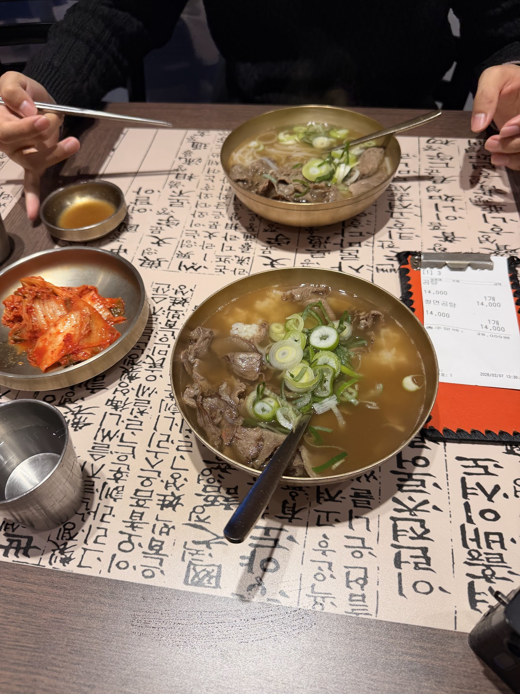
そのあとは、ソウル駅でアパレルなどを見た。
駅地下にあったオリーブヤングで買い物をした。

どの商品を韓国で買うべきかわからないかったので、行く前に買う物を目星をつけようと思った。
ただ、いつも使っているコスメもQoo10で買う時よりも安かったので、普通にいつも買うやつを買っていた。

紙袋がとても可愛かった。
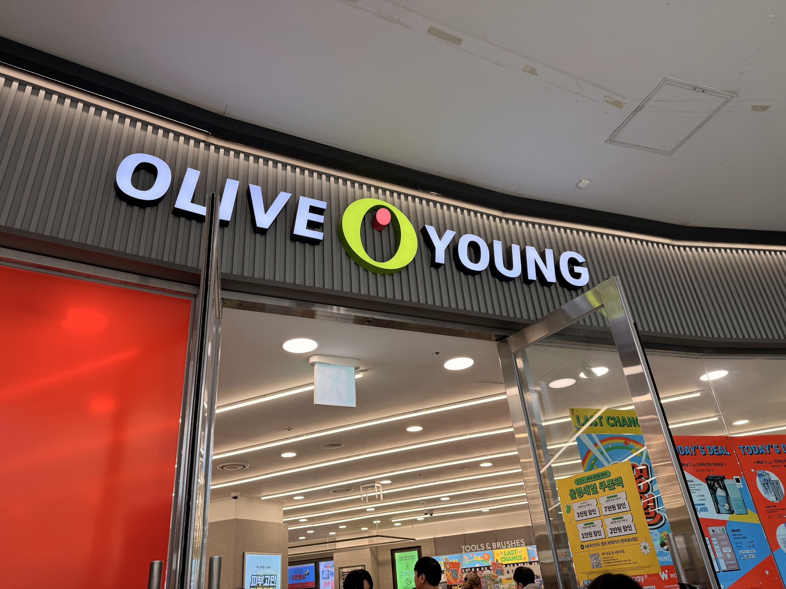
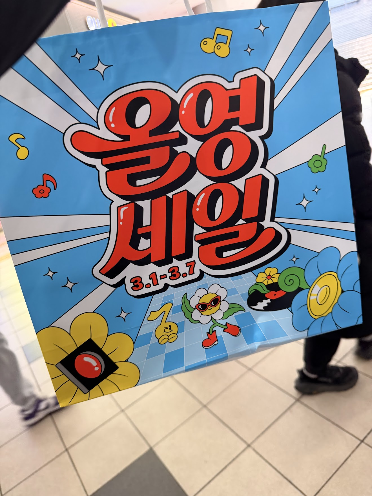

### 明洞
別予定で午前は別行動をしていた友人と明洞で合流して、明洞散策をした。
可愛いキャラクターグッズ、薬局、コスメショップなどを巡り、休憩としてマックで見たことないメニューを買って食べた。

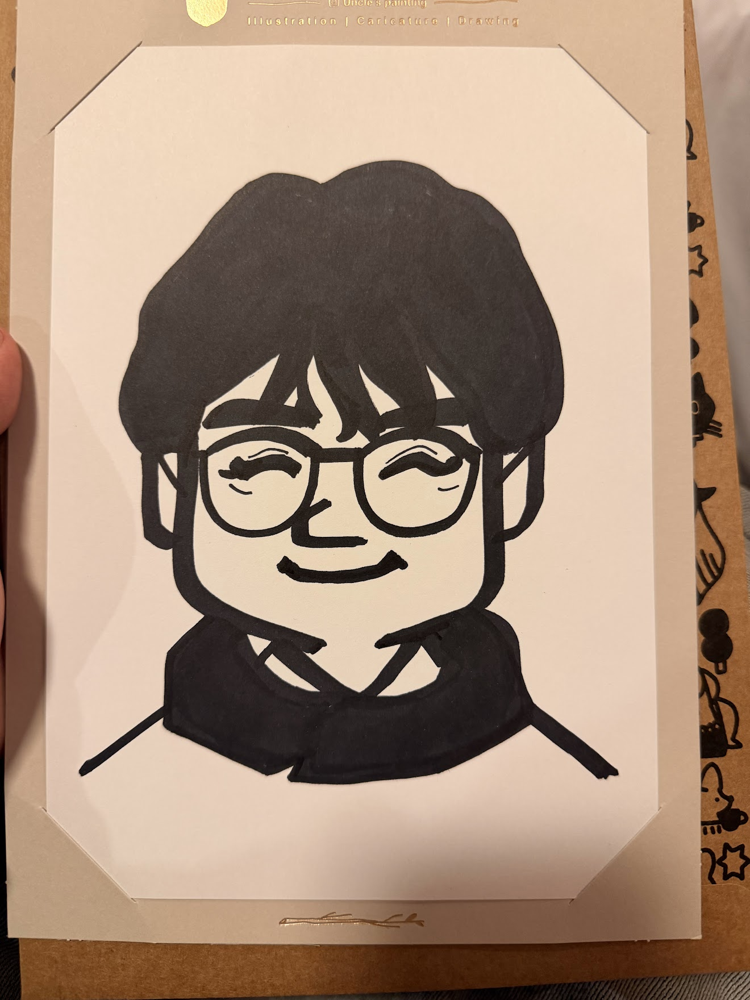
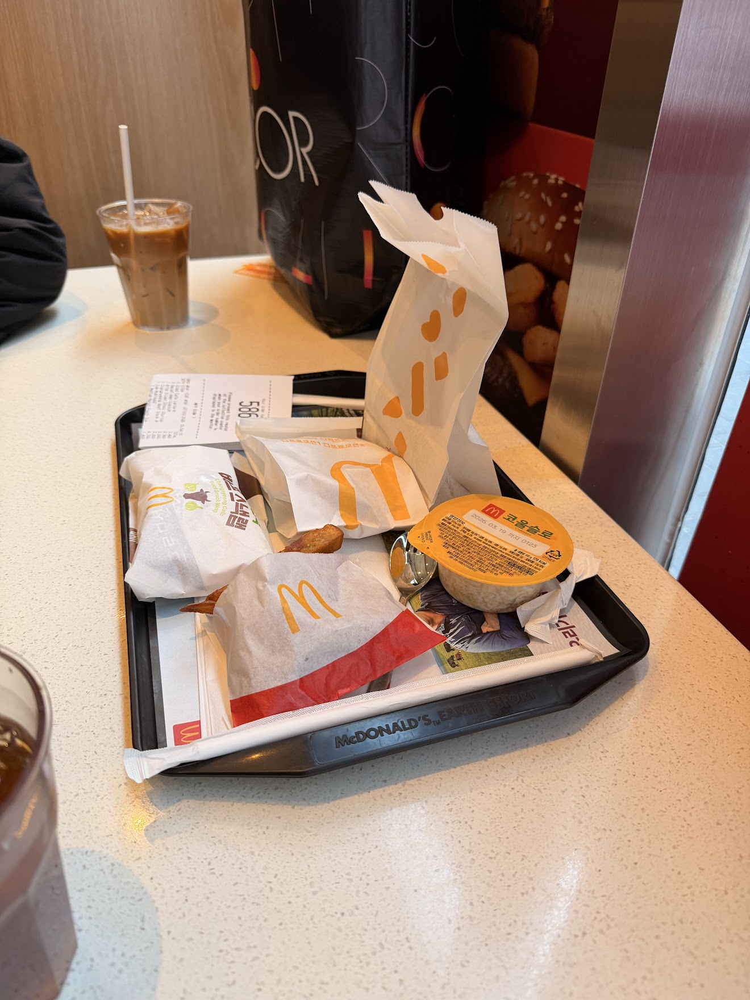

夜ご飯は[王妃家 明洞2号店](https://maps.app.goo.gl/nbsAkUi418JzuCDH8)でサムギョプサル[^samgyeopsal]を食べた。
注文したお肉は全て、店員さんがテーブルで焼いて、切り分けてくれた。キムチやサンチュ[^sangchu]はおかわりできたので、さまざまな食べ方ができた。

マッコリ[^makgeolli]とチャミスル[^chamisul]を頼んだが、マッコリがヤカンで出てきて、みんなでびっくりしていた。
個人的には見たことのないお酒を目の前にして絶望していたが、マッコリもサムギョプサルも美味しかったので、みんなで飲み干せた。

結構な量のお肉を食べたが、一人当たり5000円くらいだったので、リーズナブルだった。

その後も、明洞のお店が閉まるまで色々散策をした。

## 3日目 聖水・梨泰院・パラダイスカジノ

### 聖水
monamiストアの文具を買ったり、ポーラアットホームで雑貨を眺めたりとショッピングを楽しんだ。

monamiストアではボールペンと万年筆を買った。
万年筆はパーツごとに売っていて、組み合わせて自分だけの1本が作れた。友人にパーツを一個ずつ選んでもらい、万年筆を作って買った。
ボールペンには名入れができたが、今回はせずにそのままでもらった。

様々なアパレルショップもあるので、気になったお店には入って服を色々見た。

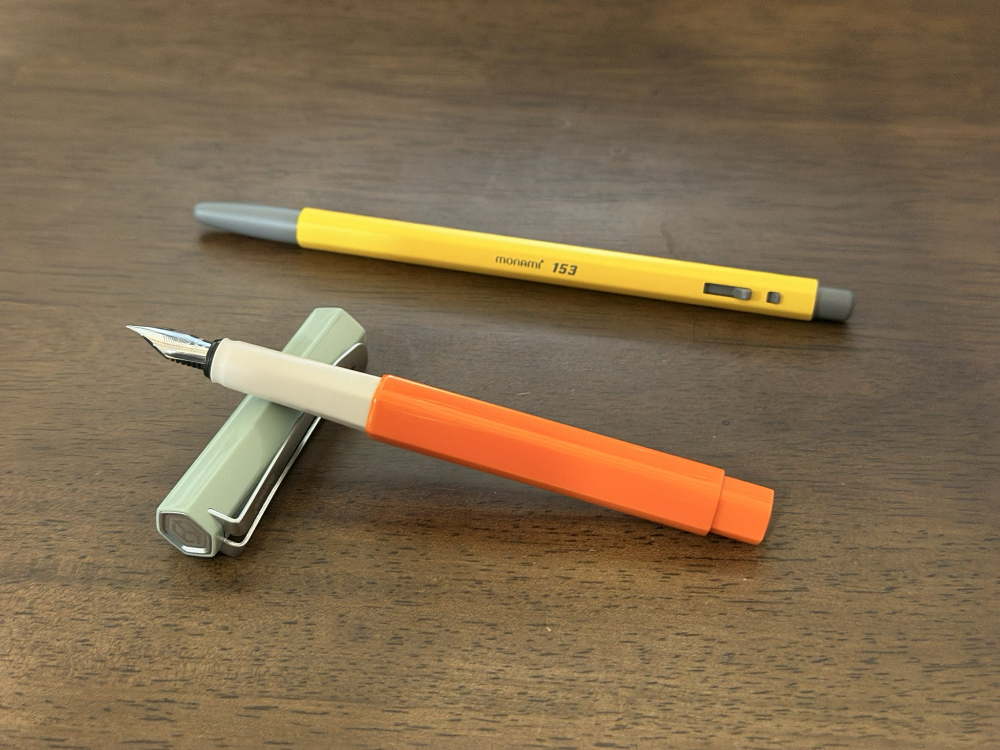

お昼は
[WON-GRANDMA BOSSAM Seongsu store](https://maps.app.goo.gl/pcnFgzbpy2XLhuxf8)
でポッサム[^bossam]を食べた。釜飯のようなご飯に最後はお湯を注いで雑炊のようにして食べた。
スープは結構な辛さがあった。

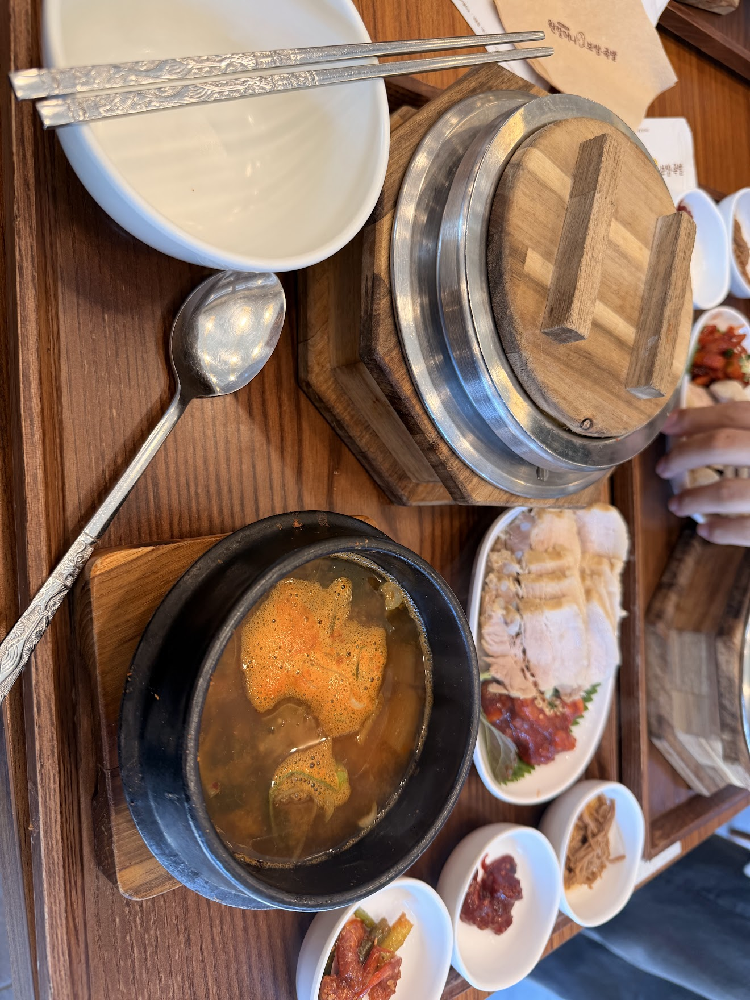

おやつには31でアイスを食べた。
日本にはないフレーバーがあったのと、店内ドリンクもフレーバーティーなどもあり充実していた。
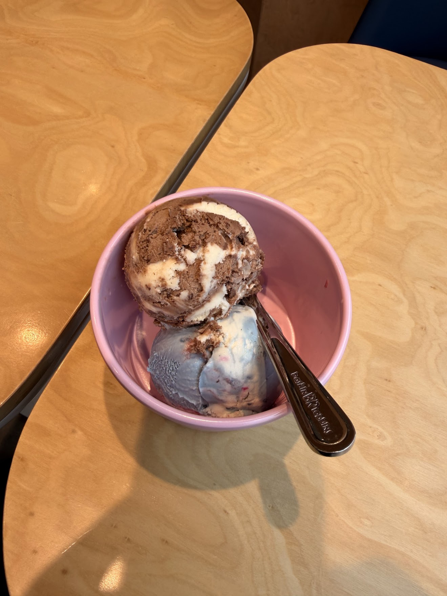

### 梨泰院
友人二人が梨泰院クラスという韓流ドラマを見ていたのでその聖地を訪れた。
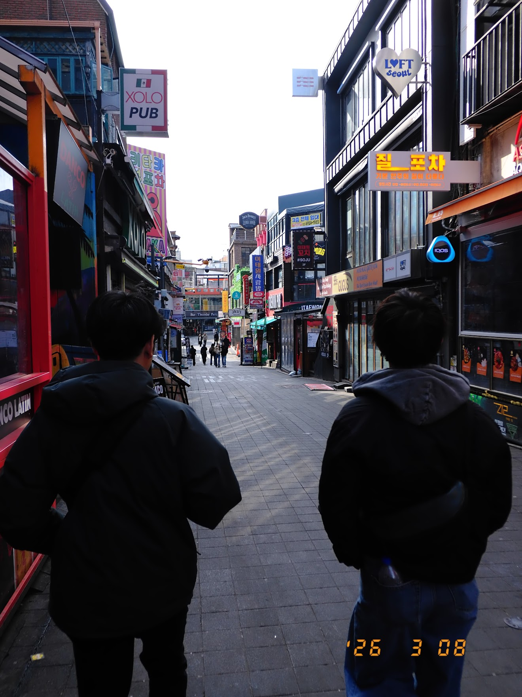

階段や坂が多く起伏の多い街だった。
クラブ街だったが、日曜日の昼だったのであまり人はいなかった。

今日から自分は梨泰院クラスを見始めました。

### パラダイスカジノ
タクシーで移動して、パラダイスカジノに行った。

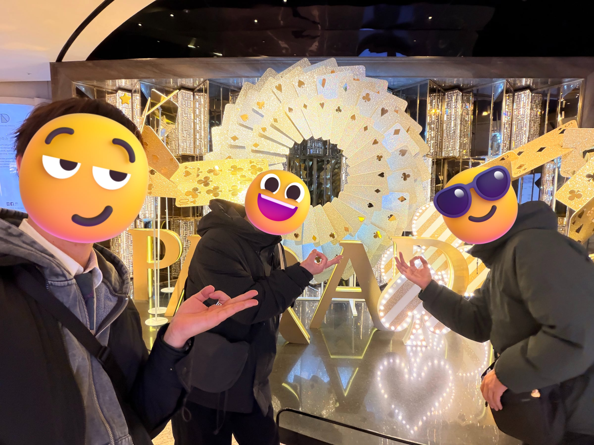

パスポート見せて入場の受付をしてメンバーカードを発行してもらった。

ルーレットのBlack or Redや奇数偶数などの1/2のものに賭けて遊んだ。

カジノはもっと張り詰めた空気の中でやるようなイメージがあったが、ちょっと静かなゲームセンターみたいな感じで
気にせず楽しめた。
スロットでは1,000ウォンが10,000ウォンになったので嬉しかった。

結果としてはプラマイゼロだったと思う(決して、負け惜しみとかではない)。

### 明洞に戻り、海鮮ディナー
[Jogabi Seafood Bar](https://maps.app.goo.gl/ogefWK4E4RVqFPCh9)で海鮮ディナーを食べた。
タコを切ってもまだ動いている状態のタコ、貝の鍋、カンジャンケジャン[^ganjang]などを食べた。

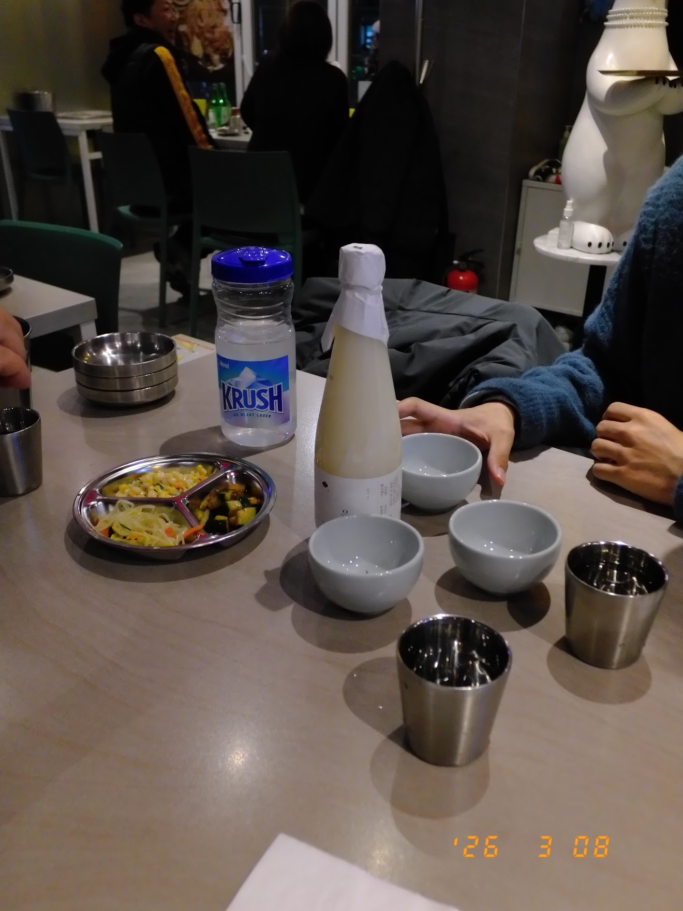

動いているタコは食べると意外と動いてる感じはしなかった。カンジャンケジャンは旨みが詰まった甘い味だった。

## 4日目: 東大門デザインプラザ/最後の明洞散策

### 東大門デザインプラザ(DDP)

建築家のザハ・ハディッドさんが設計した建物で、有機的な曲線のある建物が印象的だった。
ところどころにアート作品が展示されていた。
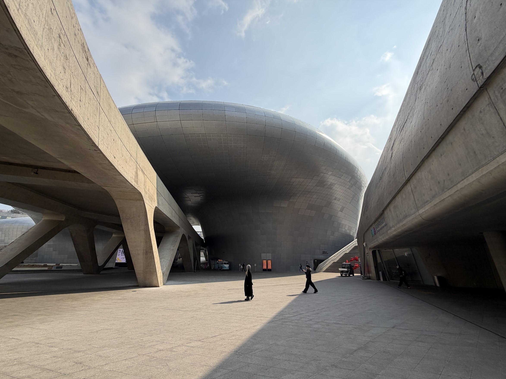
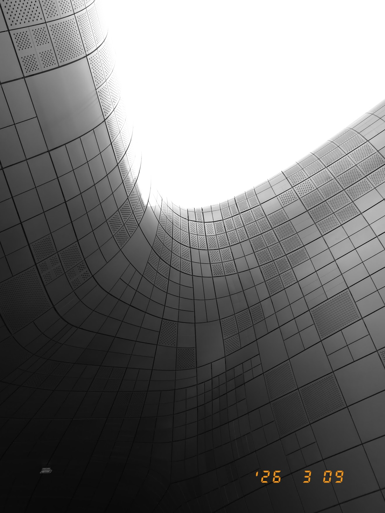

DDPにあるパン屋さんで朝ごはんを食べた。
韓国のパン屋さんはツヤツヤしているパンがなぜか多かった。

買ったら温めて切り分けてくれた。
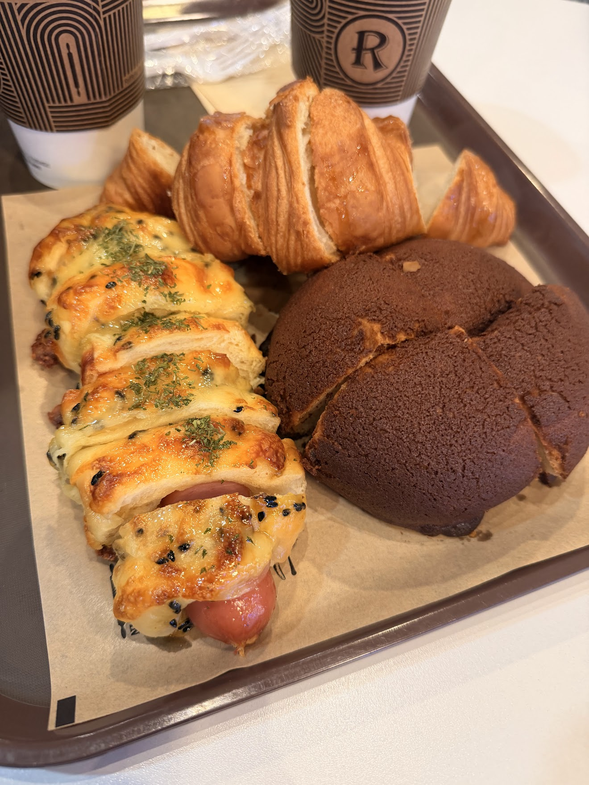

DDPの所々にあるアート作品を見ながら外観をみて、中でもイベントがやっていたのでIT技術を使ったアパレルに関する展示を見た。

お土産は韓国の洗練された雑貨や小物が売っていた。
自分は、ステッカーと帽子を買った。

### 明洞で最後の散策
コスメなどは十分に買っていたので最後にアパレルを中心に見て回った。
KODAK CENTER SHOPでKODAKのアパレルを買った。

お昼ご飯は[Premium Jangin Dakalbi](https://maps.app.goo.gl/cSdm4jX1iZbb4Pq16)
でチーズダッカルビ[^dakgalbi]を食べた。
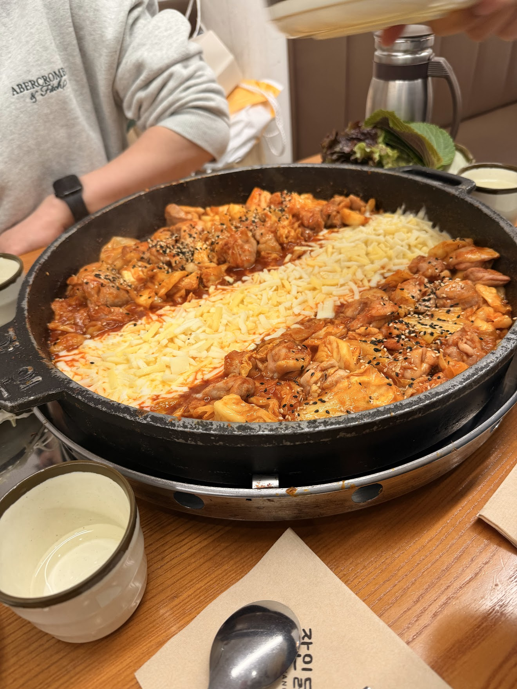

今回の旅行で一番辛かったと思う。もちろん食べれる辛さではあったので、バクバク食べていた。

### さよなら韓国
明洞駅から空港に移動して、帰路に着いた。

空港のお店では、いくつかお土産を買った。
初めてクレカの特典でついてくるプライオリティパスで入れるラウンジを使った。サラダにケーキ、ワイン、ビールなどが食べ飲み放題でよかった。

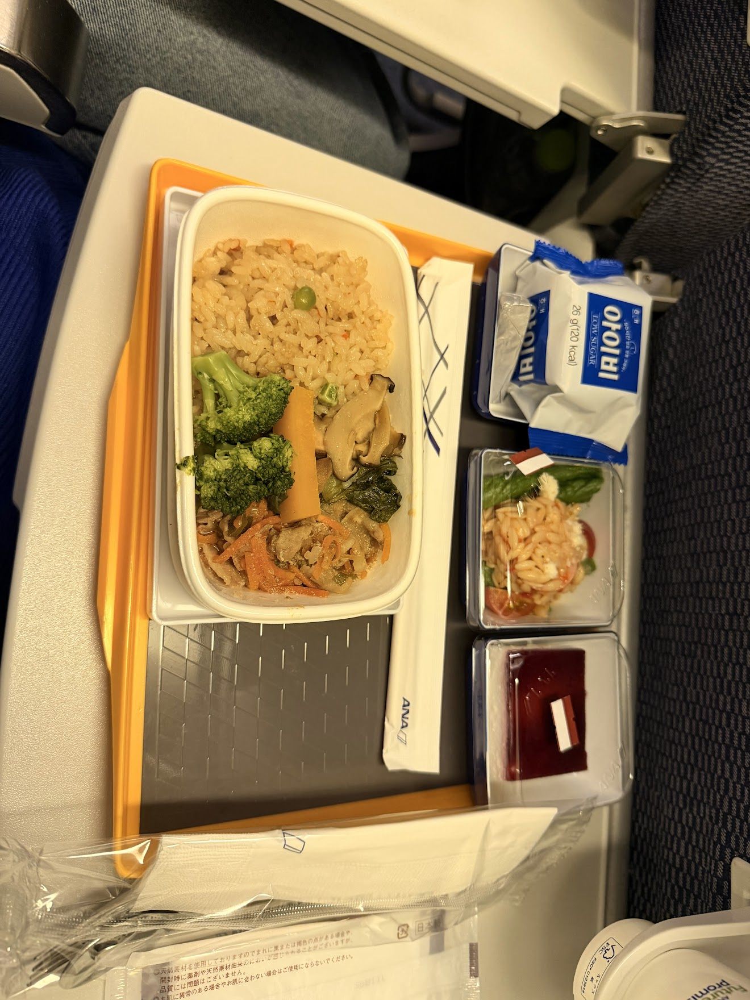

## 買ったもので良かったもの

- [LAGOM 夜用洗顔](https://lagomcosmetics.jp/products/detail.php?product_id=5)
  - すべすべになった
- [innisfree パフュームド　ボディ＆ヘアミスト ピンクコーラル](https://www.innisfree.jp/products/perfumed-body-hair-mist-1452?variant=42345434513504)
  - 香りがとにかくいい。お風呂上がりにパジャマにシュッとしてリラックスタイム
- [GRAFEN トリプルハンサムリップ](https://global.oliveyoung.com/product/detail?prdtNo=GA210000858&accParam=110&srsltid=AfmBOor1h0uGoinuZMaMQZ0TRhss0CaAO9OnEwiZ5rc-NrMeGwqYNzvt)
  - 今まで使っていたものよりマット感があり、色落ちしにくくていい。あと見た目がかっこいいのもポイント

[^chijimi]: チヂミ（전）は、小麦粉の生地に野菜や海鮮を混ぜて薄く焼いた韓国風のお好み焼き。韓国語ではジョン（전）やパジョン（파전）とも呼ばれる
[^gomtang]: コムタン（곰탕）は、牛肉や牛骨を長時間じっくり煮込んで作る韓国の白濁スープ。あっさりした味わいが特徴
[^samgyeopsal]: サムギョプサル（삼겹살）は、豚の三枚肉（バラ肉）を厚切りにして焼く韓国式焼肉。「三層肉」の意味
[^sangchu]: サンチュ（상추）は、焼肉を包んで食べるための韓国のレタスの一種
[^makgeolli]: マッコリ（막걸리）は、米を発酵させて作る韓国の伝統的な乳白色の濁り酒
[^chamisul]: チャミスル（참이슬）は、韓国の焼酎ブランド。「眞露（JINRO）」が製造する韓国で最もポピュラーな焼酎
[^bossam]: ポッサム（보쌈）は、茹でた豚肉をキムチやサンチュなどの野菜で巻いて食べる韓国料理
[^ganjang]: カンジャンケジャン（간장게장）は、生のワタリガニを醤油ベースのタレに漬け込んだ韓国料理。「ご飯泥棒」とも呼ばれるほどご飯が進む
[^dakgalbi]: ダッカルビ（닭갈비）は、鶏肉と野菜をコチュジャンベースの甘辛いソースで炒めた韓国料理。チーズをのせたものがチーズダッカルビ

---
※注釈だけAIによって生成されています。
