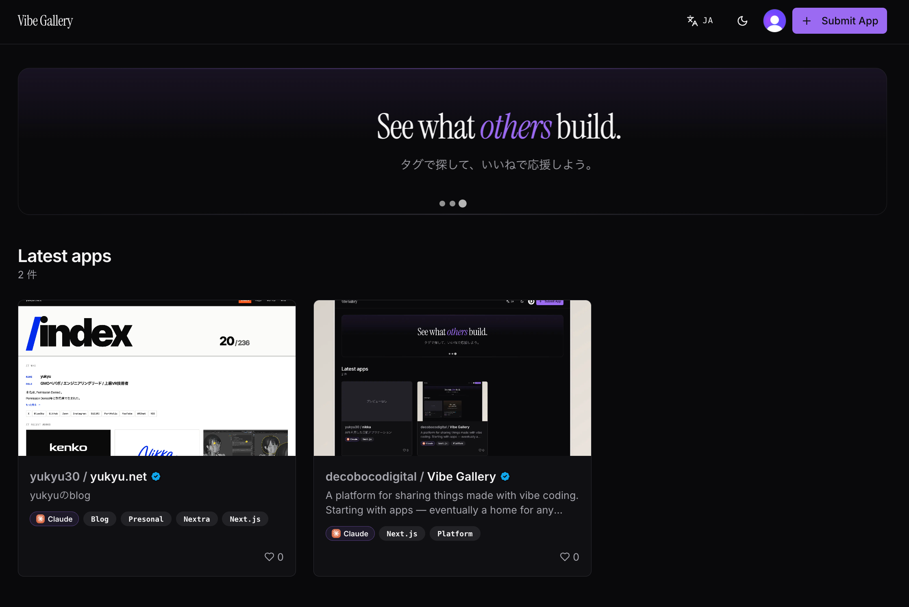
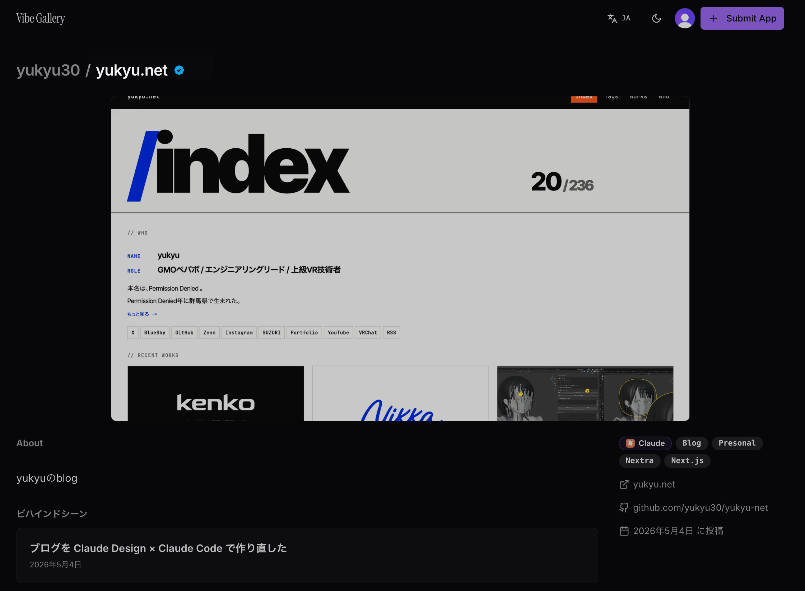
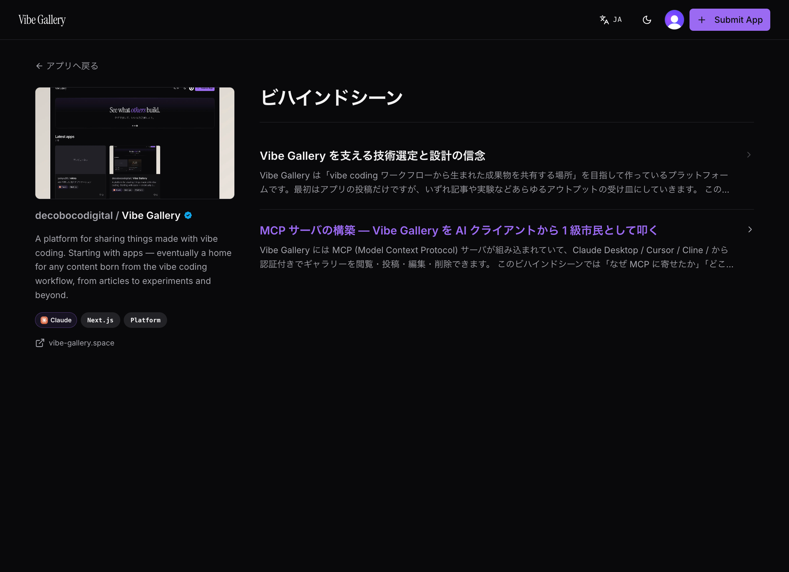

vibe codingで作ったアプリを投稿・発見できるギャラリーサイト「[Vibe Gallery](https://vibe-gallery.space)」をつくった。

## できるようになること

- 自分が作ったアプリを投稿・公開できる（タイトル / 説明 / サムネ / websiteUrl / GitHub URL / タグ / 使ったAIツール）
- タグやAIツールで他の人の作品を探せる
- アプリごとに「ビハインドシーン」記事として、開発過程や考えを書き残せる
- 自分のサイトであることを確認した上で所有確認バッジを付けられる
- ClaudeなどのMCPクライアントから直接投稿・更新できる

## なぜつくったか

vibe codingしたものを公開する場が欲しかった。
ZennやQiitaは技術ナレッジを書く場所というイメージで、単なるアプリ投稿の置き場とはちょっと違うなと個人的に思っていた。
作ったものそのものを投稿しつつ、作っている過程の記録も同じ場所で書けるサービスがほしくて、自分で作った。

## コアにしたこと

作るうえで時間をかけたのは次の3つ。

### 1. サイト所有確認

Webサイトという特性上、URLさえ知っていれば誰でも投稿できてしまう。そこで、登録するURLに対して**そのサイトの作者であること**の確認を入れた。

ユーザーごとに振られたprofile IDを、サイトのルートHTMLに次のいずれかの形で埋め込んでもらう。

```html
<!-- 方法1: meta タグ -->
<meta name="vibe-gallery-verification" content="{あなたのprofile ID}">

<!-- 方法2: html の data 属性 -->
<html lang="ja" data-vibe-gallery-verification="{あなたのprofile ID}">
```

2方式あるのは、プラットフォームによっては`<meta>`タグを自由に追加できないことがあるため。その場合は`<html>`要素のdata属性のほうを使う。

（`<html>`にも触れないようなプラットフォームの場合は、`<div>`等にdata属性を仕込んで拾う方式に広げるのもありかな、とは思っている）

サーバ側はoriginのHTMLを取りに行き、どちらかでprofile IDが見つかれば確認OK。

確認が通ったアプリにはバッジが付く。通っていないアプリも普通に表示される。



### 2. MCPからの登録

Claude Desktopなどから話しかけるだけで、アプリの投稿・更新・削除、ビハインドシーン記事の作成までできるようにしている。Webを開かずに「これさっきデプロイしたやつ、Vibe Galleryにも上げといて」で投稿が完了する。

実装は[Vercelの`mcp-handler`](https://vercel.com/changelog/mcp-server-support-on-vercel)とClerkの[`@clerk/mcp-tools`](https://github.com/clerk/mcp-tools)の組み合わせ。Clerk OAuth 2.1（DCR込み）で全ツールを保護していて、初回接続時にブラウザでClerkにサインインすれば以降はClaudeから普通にツールが呼べる。

`submit_app`は`websiteUrl`があれば内部で所有確認も一緒に走らせるので、「このアプリ投稿しといて」だけで所有確認からバッジ付与までが完結する。各クライアントの設定方法は[`/docs/mcp/install`](https://vibe-gallery.space/docs/mcp/install)にまとめてある。

### 3. ビハインドシーン

アプリページとは別に、開発の過程や試行錯誤、後からの改善などを書き残せる**ビハインドシーン記事**をアプリごとにぶら下げられるようにした。1アプリに何本でもMarkdownで書ける、ミニブログみたいなもの。

「メイキング」だと作っている過程に寄りすぎる気がして、信念や考え方も同じ場所に書けるように「ビハインドシーン」という名前にした。

例えば「[ブログを Claude Design × Claude Code で作り直した](https://vibe-gallery.space/apps/7c95c821-dff9-4cdf-9603-c79def95b2f2/behind-scenes/7433bde9-c2c2-4968-a449-e678fc83f7d0)」のような、メインの作品ページとは分けたい粒度の話を書く場所として運用している。

記事もMCPから書けるので、Claude Codeで実装した直後に「今日やったこと、ビハインドシーンに書いといて」と言えばそのまま下書きに入る。デフォルトはdraftなので、意図せず公開されることはない。

## llms.txt

公開されているすべてのページに`llms.txt`を持たせている。投稿されたアプリやビハインドシーン記事も含めて、URLの末尾に`/llms.txt`を付ければそのページのLLM向けMarkdownが返ってくる。

## 技術スタック

- **Framework**: Next.js 14 App Router (RSC)
- **DB**: Postgres + Drizzle ORM
- **認証**: Clerk
- **MCP**: `mcp-handler` + `@clerk/mcp-tools`
- **Storage**: S3互換（ローカルはrustfs）
- **UI**: Tailwind + shadcn/ui
- **Deploy**: Vercel

mutationはServer Actionsを使わず`app/api/*/route.ts`に切っている。WebもMCPも同じrepository関数を叩く構成にしたので、MCPツールは「認証 → 入力検証 → repository関数を呼ぶ」だけの薄いラッパで済んでいる。

## 感想

Terraformを使って構成管理などをしているが、なかなか面白い。

vibe codingしたものについて、どう作ったかまで含めて置けるサイトを欲しかったので作ったが、結果として自分の作りたいものになった。

なお、Vibe Galleryそのもののビハインドシーンも[Vibe Galleryに投稿している](https://vibe-gallery.space/apps/ee147adf-2288-4ef4-b389-b9252ef03b74/behind-scenes)ので、詳細が気になる人はそちらをどうぞ。



[https://vibe-gallery.space](https://vibe-gallery.space) は現在早期アクセス中で、まだパブリックには開けていない。
触ってみたい・投稿してみたいという人がいたら声をかけてもらえると嬉しい。
