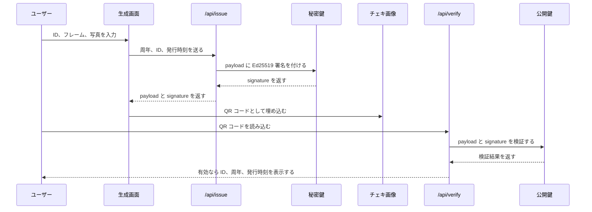
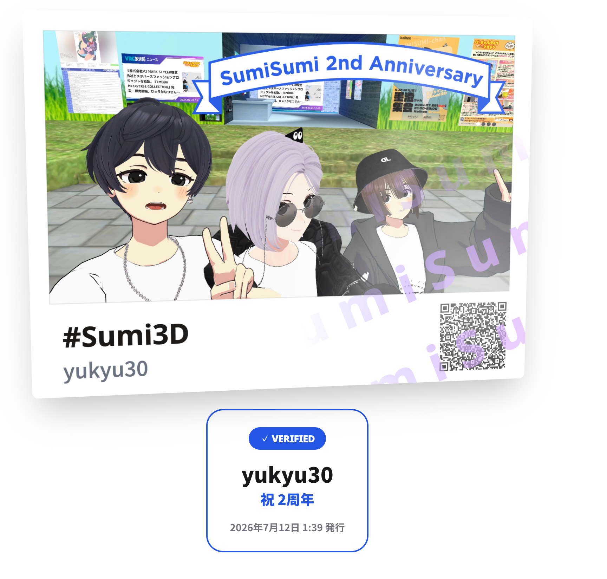

[anniversary-image-kit](https://github.com/yukyu30/anniversary-image-kit) を公開した。

アバターやキャラクターの周年記念に、チェキ風の画像を作って配るための Next.js テンプレートである。
写真とフレームの色を選ぶと、下部に ID、ハッシュタグ、QR コードを入れた画像を生成できる。
生成した画像は保存して SNS に投稿できる。

もともとは [墨澄2周年記念ジェネレーター](https://sumisumi-anniversary.lolipop-now.app/) を作ったときの仕組みである。
アバターやキャラクターを差し替えて使える構成だったので、テンプレートとして切り出した。

## チェキ画像への署名

このテンプレートでは、生成したチェキ画像の QR コードに、署名済みのデータを入れている。

周年記念の画像には、「このタイミングで発行された画像」という扱いを持たせたかった。
そのため、サイトが発行したデータに電子署名を付けている。

ここでいう署名は、画像そのものに手書きサインを入れることではない。

サーバーが秘密鍵で署名を作り、検証画面が公開鍵でその署名を確かめる仕組みである。
秘密鍵を持つサーバーだけが有効な署名を作れるため、第三者が同じ形式の QR コードを作っても検証には通らない。

署名対象のデータは、周年、ID、発行時刻である。
`/api/issue` がこれらを Ed25519 で署名し、`payload + signature` を QR コードへ埋め込む。
`/api/verify` は QR コードから取り出したデータを公開鍵で検証し、署名が正しいときだけ ID、周年、発行時刻を表示する。

秘密鍵はサーバーの環境変数にだけ置く。
公開鍵は検証にしか使えないため、クライアント側のコードに含めてもよい。

流れは次のとおりである。

## 署名の確認
正しく署名が確認できるとホログラムでいい感じなチェキが表示されるようにした。

## デプロイ先はロリポップ！デプロイナウを使った

デプロイは [ロリポップ！デプロイナウ](https://lolipop.jp/deploy-now) を利用した。

勤務先のサービスではあるが、無料プランでもサイトを公開できる。

アバターやキャラクターの周年を祝うサイトを作りたい人は、[anniversary-image-kit](https://github.com/yukyu30/anniversary-image-kit) を使ってみてください。
