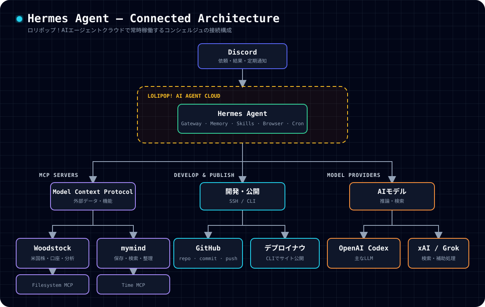

いま使っているHermes Agentは、[ロリポップ！AIエージェントクラウド](https://lolipop.jp/ai/agent-cloud/)上で動いている。

Discordから話しかけると、Hermes Agentがクラウド上で調査やファイル編集を行い、必要に応じてMCPや外部サービスを呼び出す。
GitHubのリポジトリを更新したり、[ロリポップ！デプロイナウ](https://lolipop.jp/deploy-now/)を使ってWebサイトを公開したりするところまで任せられるようになった。

接続先が増えてきたので、2026年7月20日時点の構成を整理しておく。

## 全体の構成

現在の流れは次のようになっている。

GitHubとデプロイナウは、Hermes Agentから個別に操作している。

ここでMCPと呼んでいるものは、Hermes Agentが外部のデータや機能を共通の方法で扱うための接続先である。
GitHub、Discord、デプロイナウ、LLMプロバイダーは、MCPとは別の方法で接続している。

## ロリポップ！AIエージェントクラウド

[ロリポップ！AIエージェントクラウド](https://lolipop.jp/ai/agent-cloud/)は、Hermes Agent本体を動かしている場所である。

自宅のPCを起動したままにしなくても、クラウド上でHermes AgentとGatewayが動き続ける。
Discordからのメッセージを受け取り、定期実行のジョブも処理できる。

Hermes Agentは記憶、スキル、ファイル操作、ブラウザー操作、定期実行、サブエージェントなどの機能を持つオープンソースのエージェントである。
現在はOpenAI Codexを主なLLMプロバイダーとして使っている。

- [ロリポップ！AIエージェントクラウド](https://lolipop.jp/ai/agent-cloud/)
- [Hermes Agent](https://hermes-agent.nousresearch.com/)

## Discord

[Discord](https://discord.com/)は、Hermes Agentとの主な会話画面として使っている。

Discordのチャンネルやスレッドから依頼を送り、調査結果、生成したファイル、定期通知を同じ場所で受け取れる。
Hermes Agentが別のサーバーで動いていても、普段使っているDiscordから操作できるため、専用の管理画面を開く回数が少なくて済む。

## GitHub

Hermes AgentはSSHで[GitHub](https://github.com/)へ接続している。

リポジトリの取得、ブランチの作成、コードや記事の編集、テスト、コミット、pushまでを一つの作業として進められる。
このブログのリポジトリである[yukyu30/yukyu-net](https://github.com/yukyu30/yukyu-net)も、Hermes Agentから更新できる。

ただし、GitHubへ接続できることと、変更を無条件で公開してよいことは別である。
認証情報は記事やリポジトリへ書かず、公開や破壊的な操作は依頼の範囲を確認してから実行する。

## ロリポップ！デプロイナウ

WebサイトやWebアプリの公開には、[ロリポップ！デプロイナウ](https://lolipop.jp/deploy-now/)を利用できる。

デプロイナウはAIエージェントからCLIで操作でき、Next.jsのプロジェクトをビルドして公開URLを発行する。
Hermes Agentへ「デプロイして」と依頼すれば、プロジェクトの確認から公開、公開後の動作確認までを続けて進められる。

現在の構成では、Hermes AgentがGitHubのリポジトリを操作し、デプロイナウはCLIから実行する。
デプロイナウの公式ページではGitHub連携による自動デプロイも案内されているが、2026年7月20日時点では近日公開の機能として掲載されている。
そのため、現時点の公開処理はGitHub自動連携を前提にしていない。

## Woodstock MCP

[Woodstock MCP](https://woodstock.co/ja/mcp)は、米国株の情報取得、分析、口座情報の参照、注文などをAIエージェントから扱うための接続先である。

Hermes AgentからWoodstockのMCPサーバーへ接続し、149個のツールを読み込んでいる。
株価データ、保有資産、注文、テクニカル指標、バックテストなどを同じ会話から扱える。

接続方法と認証で詰まった点は、[Woodstock MCPをHermes Agentにつなぐまで](/posts/2026-07-19-woodstock-mcp-hermes)にまとめた。

取引まで実行できる接続先なので、分析と発注は区別する必要がある。
市場データを調べるだけの依頼から、勝手に注文へ進めないようにしている。

## mymind MCP

[mymind](https://mymind.com/)は、リンク、画像、記事、引用、メモなどを保存するための個人用コレクションである。

Hermes AgentとはOAuthで接続している。
会話の中で「mymindに保存して」と依頼すると、URLや文章を保存できる。
以前保存したものの検索、タグの追加、スペースへの整理、Top of Mindへのピン留めにも対応している。

GitHubがコードや公開記事の保管場所なら、mymindはあとで思い出したい資料や発想の保管場所として使い分けている。

## Filesystem MCP

Filesystem MCPは、Hermes Agentが動く環境のファイルを扱うための接続先である。

許可されたディレクトリの一覧取得、読み込み、書き込み、移動、検索ができる。
ブログの原稿やソースコードを編集できるのは、このファイル操作機能とHermes Agent標準の開発ツールがあるためである。

操作範囲はサーバー全体ではなく、あらかじめ許可したディレクトリに限定している。

## Time MCP

Time MCPは、現在時刻やタイムゾーンを扱うための接続先である。

定期通知、締め切り、相場の取引時間など、時刻が結果に影響する処理で使う。
サーバーの時刻を推測せず、実際の時刻を取得してから処理を進められる。

## OpenAI CodexとxAI

Hermes Agentの主な推論には、OAuthで接続した[OpenAI Codex](https://openai.com/codex/)を使っている。
記事執筆時点の主モデルはGPT-5.6系である。

[xAI](https://x.ai/)にもOAuthで接続しており、Xの検索や一部の補助処理にGrokを利用する。
一つのモデルへすべてを任せるのではなく、コーディング、検索、要約などの処理に応じて接続先を分けている。

## MCPと標準機能を分けて考える

Hermes AgentでできることのすべてがMCP経由ではない。

現在接続しているMCPは次の四つである。

| MCP | 主な用途 | 接続方式 |
| --- | --- | --- |
| Woodstock | 米国株の情報取得、分析、口座操作 | HTTP |
| mymind | 保存、検索、整理 | HTTP + OAuth |
| Filesystem | 許可されたファイルの操作 | ローカルプロセス |
| Time | 現在時刻、タイムゾーン | ローカルプロセス |

一方、Discord、GitHub、デプロイナウ、OpenAI Codex、xAIはMCP以外の仕組みで接続している。
定期実行、永続メモリ、ブラウザー操作、サブエージェントもHermes Agent側の標準機能である。

この区別をしておくと、不具合が起きたときに、MCPの接続、外部サービスの認証、Hermes Agent本体のどこを確認すべきか判断しやすい。

## いまの運用でできること

現在の構成では、Discordから次のような作業を依頼できる。

- GitHubのリポジトリを調査し、コードや記事を更新する
- テストとビルドを実行し、結果を確認する
- デプロイナウでWebサイトやWebアプリを公開する
- Woodstock MCPで米国株のデータや口座情報を調べる
- mymindへ資料を保存し、以前保存した情報を検索する
- 指定した日時や周期で処理を実行し、Discordへ通知する
- 複数のサブエージェントへ調査やレビューを分担する

これらを一つの巨大なサービスだけで実現しているわけではない。
Hermes Agentを中心に、実行環境、会話画面、コード管理、公開先、MCP、LLMを接続して構成している。

接続先を増やすほどできることは増えるが、同時に認証情報と操作権限の管理も必要になる。
用途ごとに接続先を分け、秘密情報を公開ファイルへ残さず、外部へ影響する操作だけは明示的に扱う方針で運用していく。
