{/* 草案。写真、ベディボの正式表記、仁川空港での続きは追記予定。 */}

## はじめに

2026年の9月3日〜9月6日に3泊4日の韓国旅行をした。
[3月に初めて韓国へ行って](/posts/2026-03-15)、今回で2回目だった。

今回も明洞や聖水でお店を巡りつつ、愛妓峰へ行くDMZツアーに参加したり、NANTAというショーを見たりした。

## スケジュール

- 9月3日: 羽田からソウルへ → ホテルにチェックイン → 明洞で買い物 → サムギョプサル
- 9月4日: 広蔵市場 → 聖水でお店巡り → 東大門で買い物
- 9月5日: DMZツアーで愛妓峰へ → 明洞の屋台巡り → クリニック → NANTA → 豚足
- 9月6日: 明洞で買い物 → 弘大のAKプラザ → 仁川のパラダイスシティのカジノ → 仁川空港

## 1日目 明洞で買い物

### 羽田からソウルへ

行きの飛行機は大韓航空（Korean Air）で、羽田からソウルの金浦空港へ向かった。  
機内食はビビンバだった。コチュジャンも別添えで準備されていて、おいしかった。

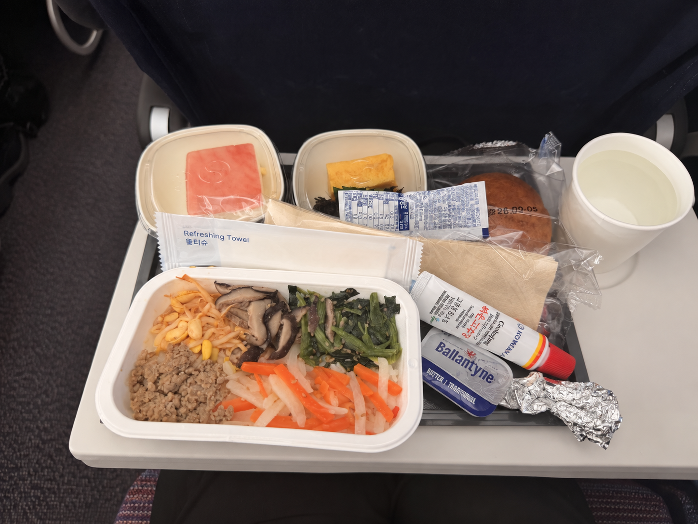

### ホテルにチェックイン、明洞散策

今回泊まったのは、鍾路3街駅の近くにある[HERTZ Hotel](https://www.expedia.co.jp/HERTZ-Hotel.h97923607.Hotel-Information)。鍵が閉まらなくて、スタッフさんに助けを求めたら、強くドアノブを押し込むとオートロックでちゃんと閉まるからという何とも強引な解決策を提示されて笑った。基本シャワー浴びて寝るだけなのでそこまでホテルにお金をかけてなかったので許容範囲内。

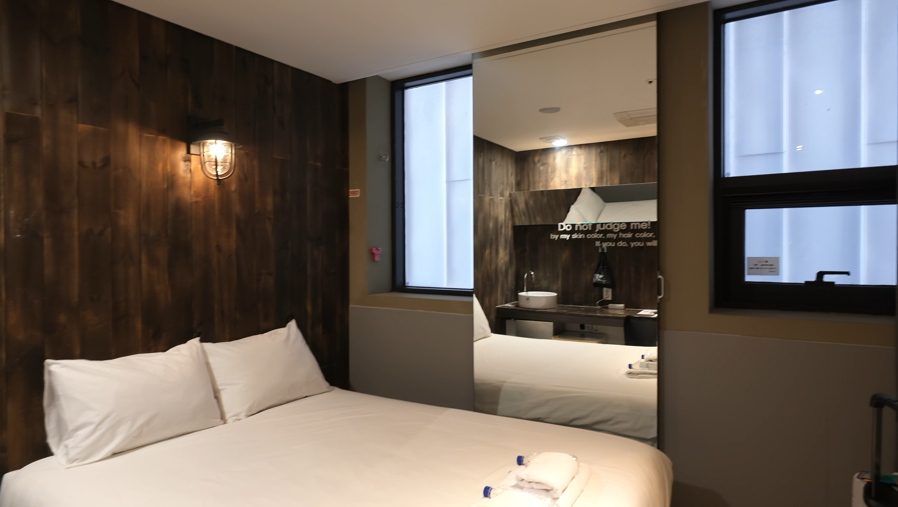

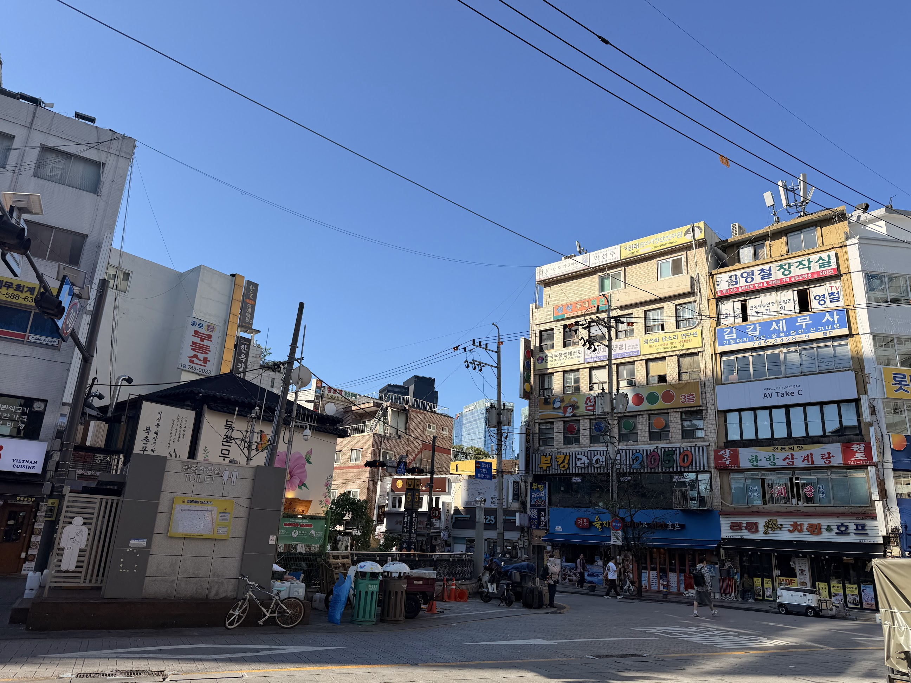

ホテルにチェックインしてから、明洞のお店を見て回った。

オリーブヤング、MIMILINE、ダイソー、THE NORTH FACEなどを巡った。
コスメから雑貨、服まで、初日から色々なお店を見た。

### MIMILINEでキーホルダー作り

MIMILINEでは、好きなワッペンを組み合わせてキーホルダーを作った。

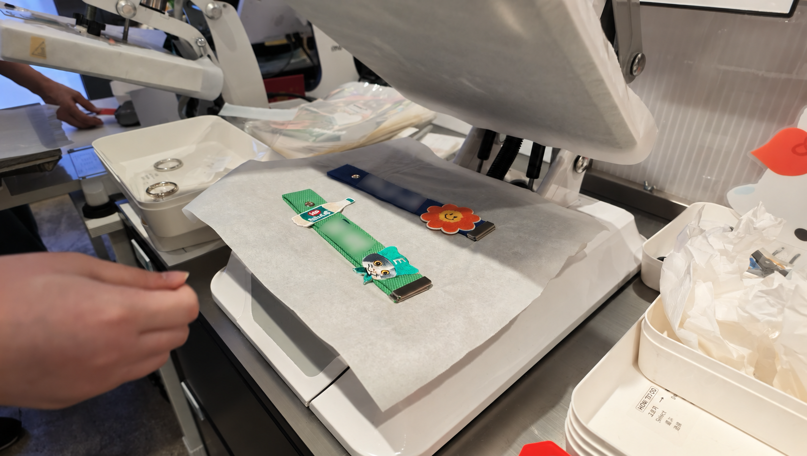

### 晩御飯はサムギョプサル

晩御飯は王妃家の明洞本店でサムギョプサルを食べた。
前回の旅行でも食べたが、今回も初日からサムギョプサルだった。

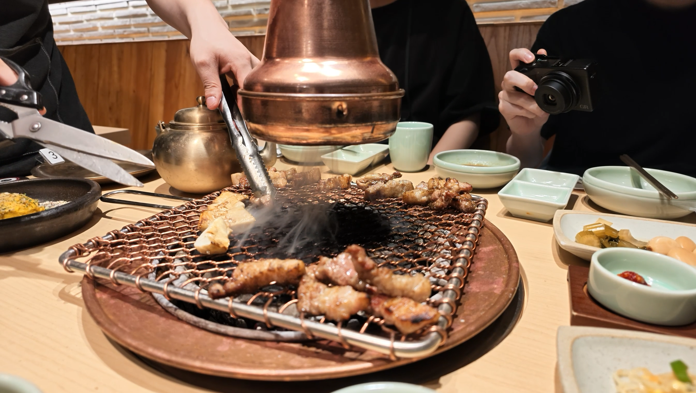

## 2日目 広蔵市場・聖水・東大門

{/* スタンダードブレッドの訪問日・時間帯は仮置き。 */}

### ホテル近くのスタンダードブレッドへ

ホテル近くのスタンダードブレッドに行った。
顔の付いたパンが可愛かった。

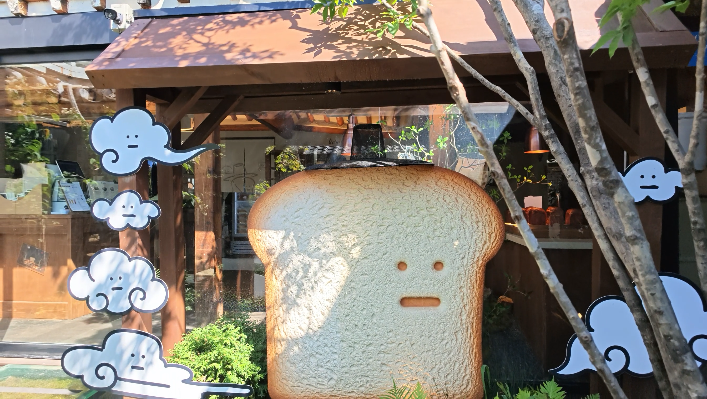

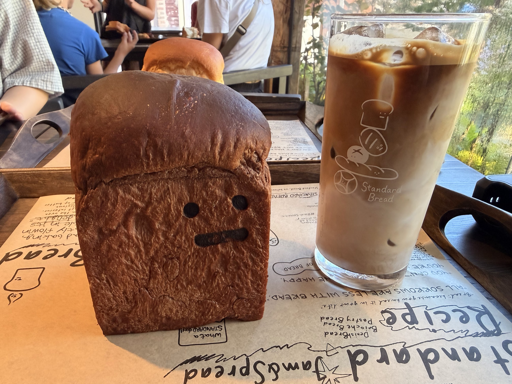

### 広蔵市場から聖水へ

広蔵市場（カンジャンシジャン）を見て回ってから、聖水（ソンス）へ移動した。
前回も訪れた場所だが、今回も色々なお店を巡った。

### オリーブヤングN

聖水ではオリーブヤングNにも行った。
品揃えが良く、色々な商品を見て回れた。

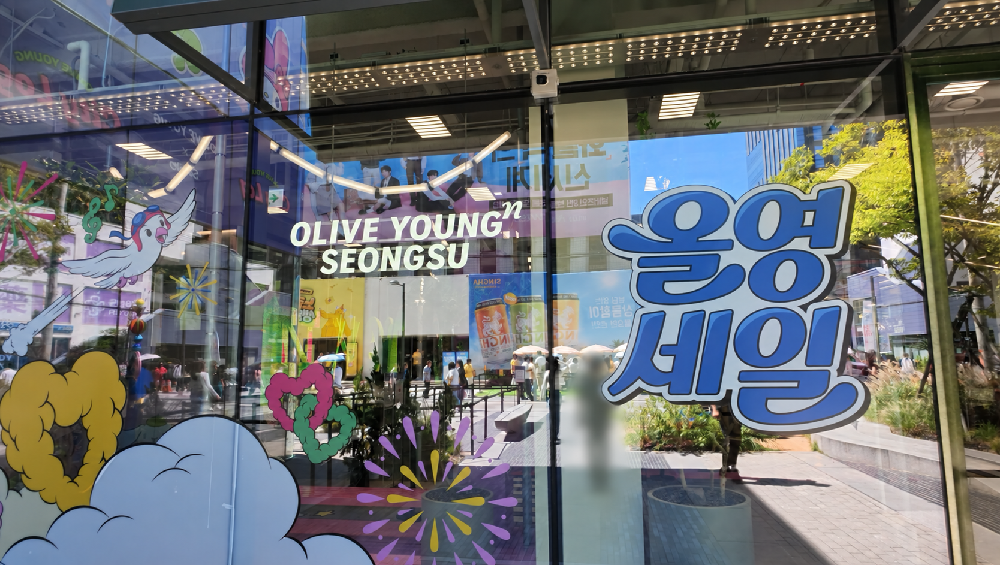

ちょうどオリーブヤングのセールをやっていて、サンリオともコラボしていた。
聖水のお店にはカラフルな展示があり、キャラクターたちが並んでいて可愛かった。

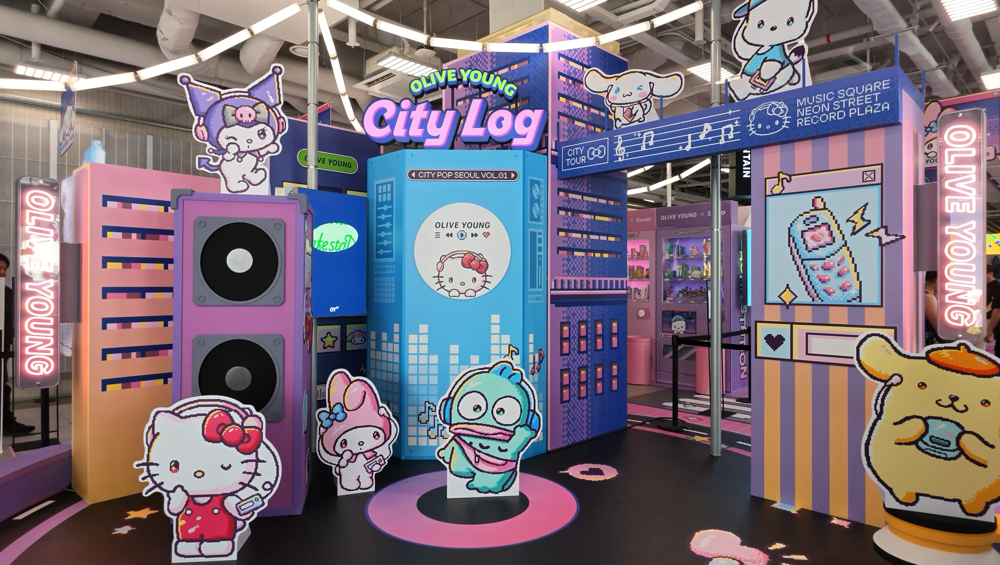

### アパレル巡りとクロッフル

そのまま聖水でKODAKのアパレルやBLUE ELEPHANTを見た。
途中、ベディボでクロッフルを食べて休憩した。

MUSINSAにも立ち寄り、服を見て回った。

ADER ERRORも見たが、やはりデザインがかっこよくて一着欲しいなと思った。
高いので、まだ買えていないが……。

### 東大門でも買い物

そのあとは東大門へ移動した。
現代シティアウトレット、DOOTA MALL、MIMILINEを見て回った。

明洞に続いて、東大門でもMIMILINEに行った。

ここには、シールやチャームを入れて好きに飾れるスマホケースがあった。
みんなで「かわいい」と言いながら見ていた。
ケースを買って、ポチャッコのシールやチャームを入れた。

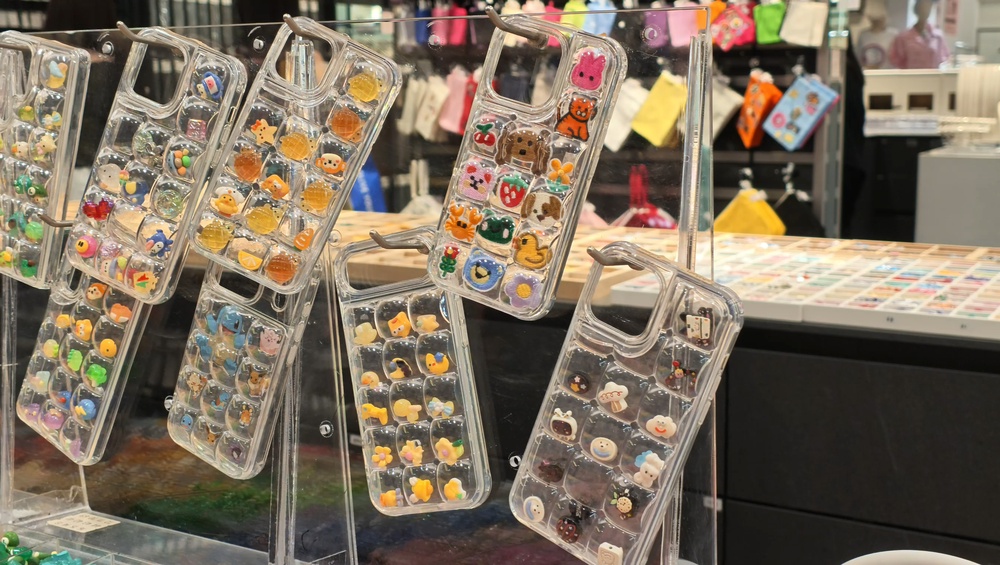

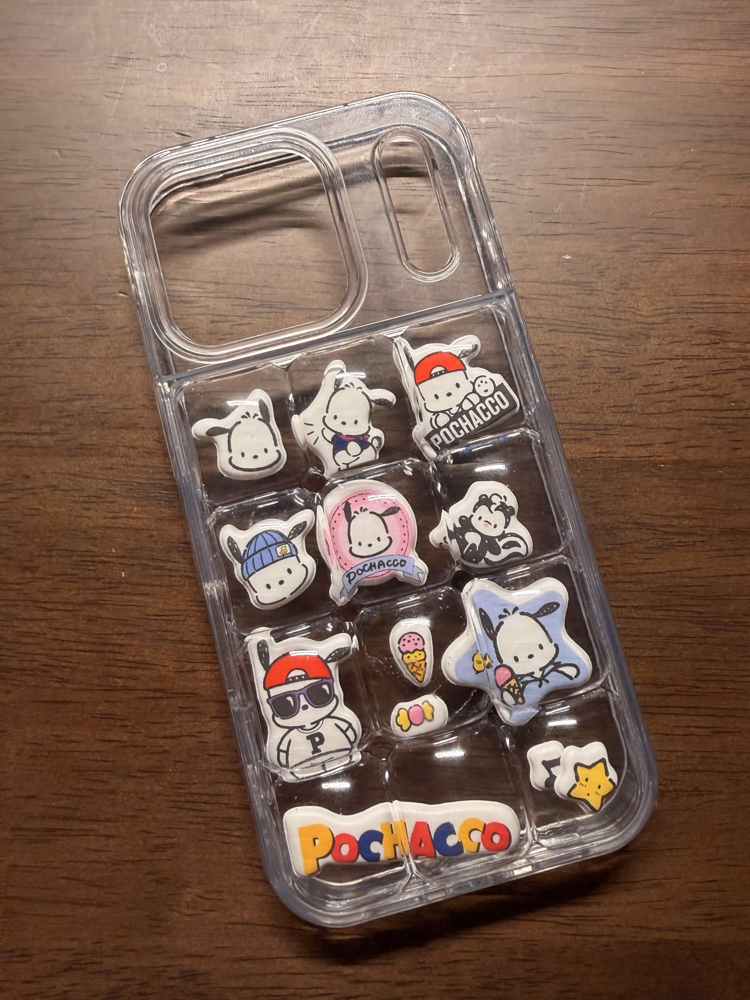

この日は聖水から東大門まで、お店をたくさん巡る一日だった。

### 東大門で晩御飯

晩御飯は「スンミネ ヘンボッケジャン 東大門直営店」でカンジャンケジャンを食べた。

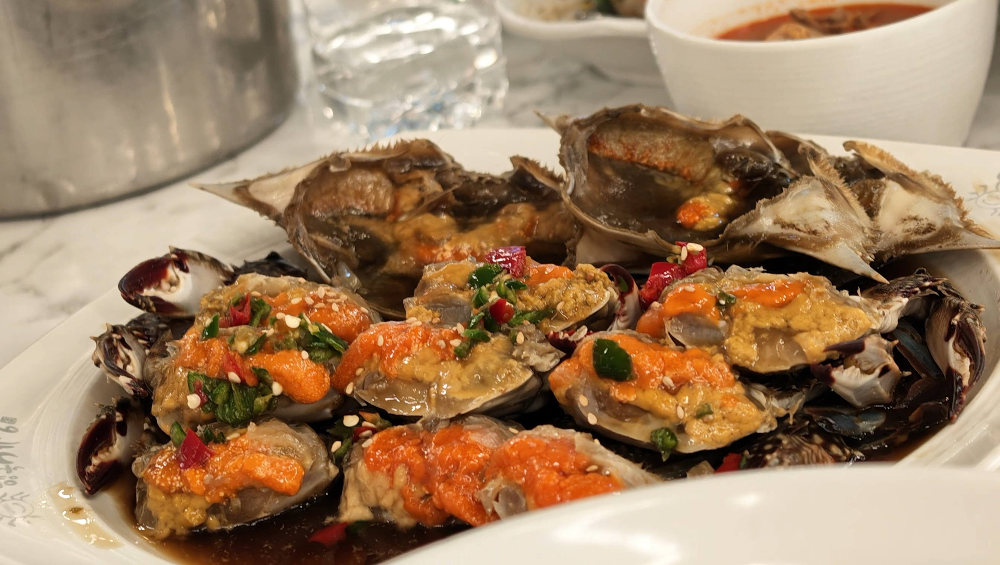

## 3日目 DMZツアーとNANTA

### 朝6時に起きてツアーへ

朝6時に起きて、愛妓峰へ行く[DMZツアー（Klook）](https://www.klook.com/ja/activity/143524-dmz-peace-trail-barracks-aegibong-war-museum-tour-from-seoul/)に参加した。
集合場所の近くにあるHOLLYSで朝食を済ませてから、バスに乗った。

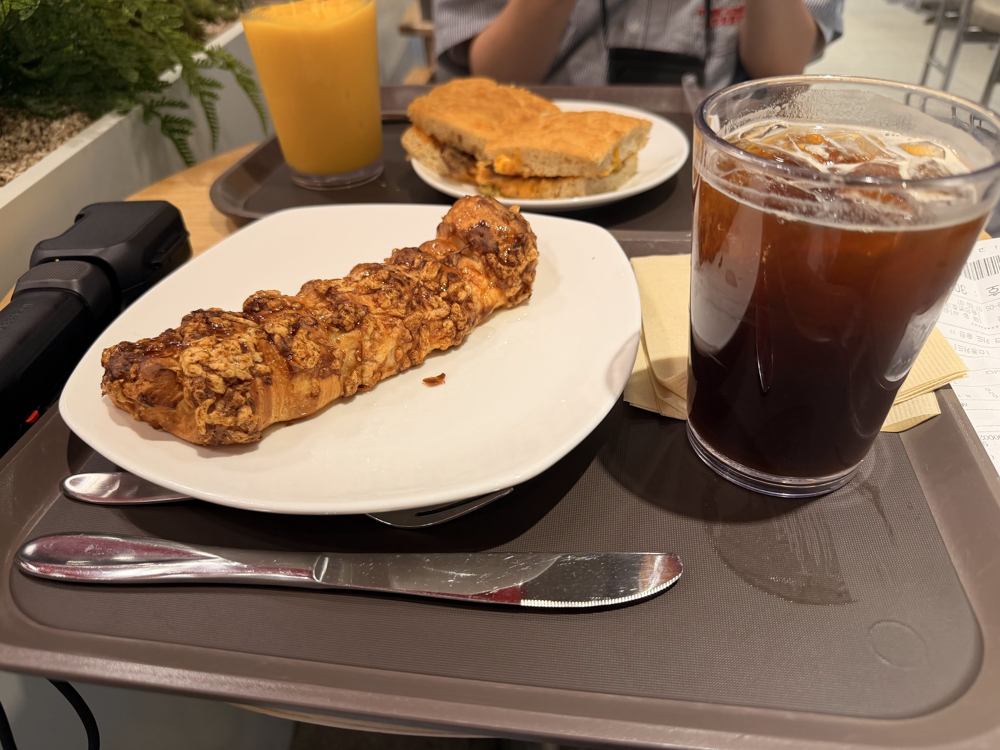

今回向かったのは、愛妓峰（エギボン）平和エコパーク。
バスの車内では、韓国の歴史などをガイドさんに話してもらった。

### 愛妓峰の展望台へ

到着してから吊り橋を渡り、スターバックスのある展望台へ向かった。

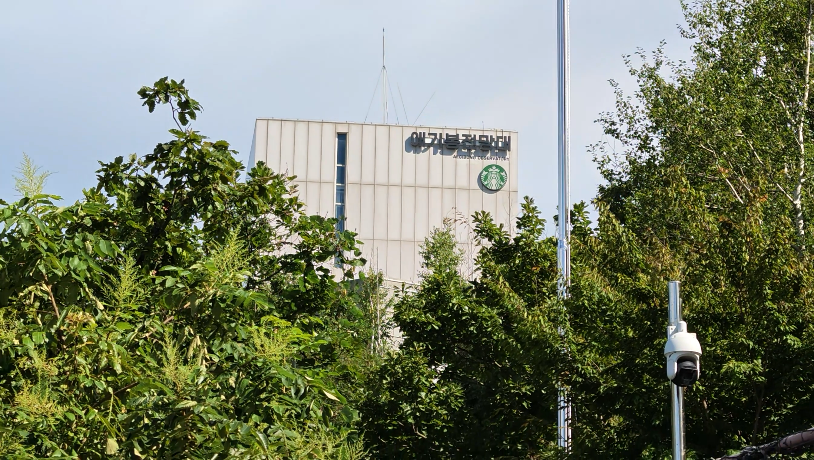

愛妓峰平和エコパークにあるスタバからは、約1.4km先に北朝鮮が見える。

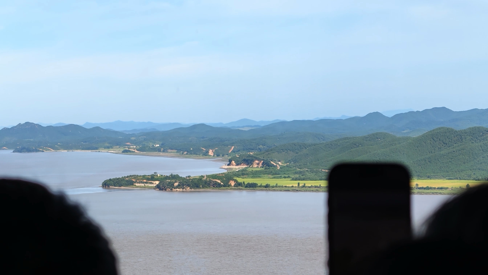

見慣れたスタバがある場所で、川の向こうには北朝鮮が見えている。
普段の生活につながるような風景と、国が分かれている現実が同じ場所にあることに、不思議な感覚があった。
ニュースで見聞きしていた場所が、実際にはこんなに近くにあるのだと感じた。

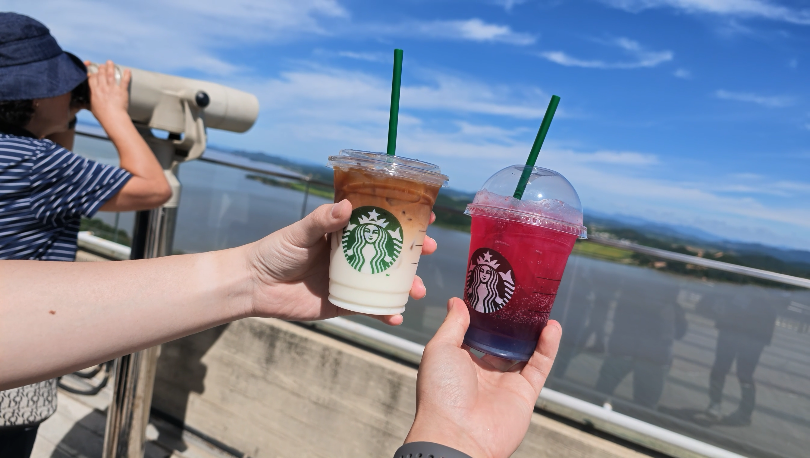

### 明洞に戻って屋台巡り

明洞に戻ってきてからは、屋台を巡った。
そのあとはクリニックへ行った。

### クリニックのあとは31へ

クリニックが終わったあと、31でアイスのトリプルを頼んだ。
「母はエイリアン」というフレーバーは覚えているが、他は覚えていない。でも美味しかった。

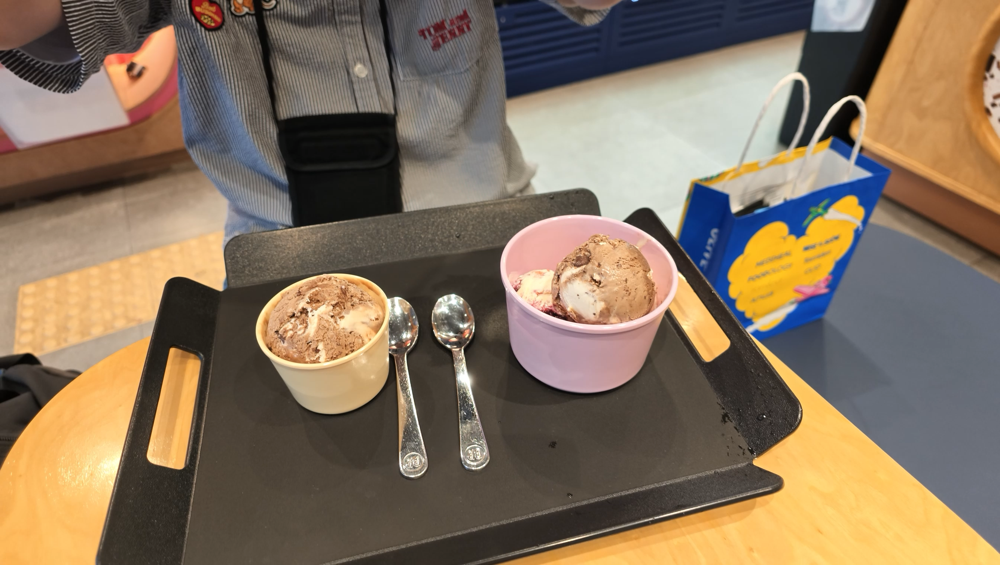

そのあとはホテルに戻って少し休憩した。

### NANTAを見た

ホテルで休んだあとは、NANTAというショーを見に行った。

シェフたちが急いで披露宴の料理を準備するという内容で、様々なものを使って音楽を奏でるショーだった。
料理の準備が演奏になっていくのが面白く、楽しかった。

観客参加型のショーでもあり、合計で10人くらいがステージに呼ばれていて面白かった。基本セリフはなく、あっても単語一言の英語くらいなので外国語がわからなくても楽しめた。

### 晩御飯は豚足

ショーを見たあとは、晩御飯に豚足を食べた。
朝早くから愛妓峰へ行き、夜はショーまで見て、色々なことをした一日だった。

## 4日目 明洞・弘大・仁川

### 明洞のANGELINUSで朝ご飯

朝ご飯は明洞のカフェ、ANGELINUSで食べた。

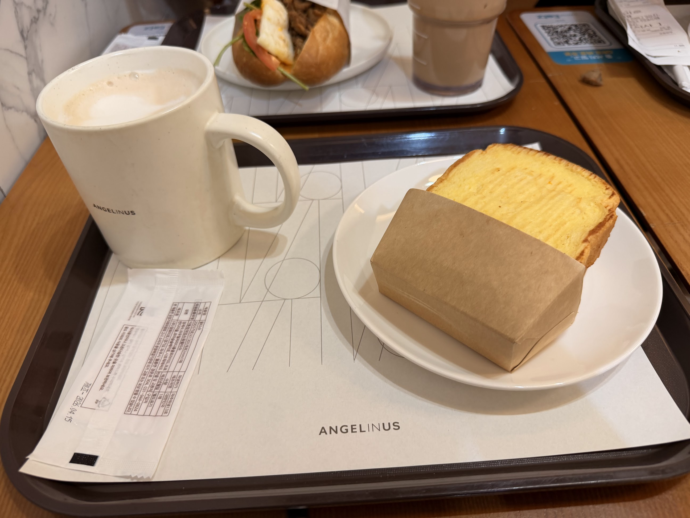

### 明洞で最後の買い物

最終日は明洞で買い残していたものを買った。スーパーに立ち寄り、BUTTERにも立ち寄った。
ぬいぐるみや雑貨が並んでいて、その中にいた星のキャラクターに一目惚れして買った。

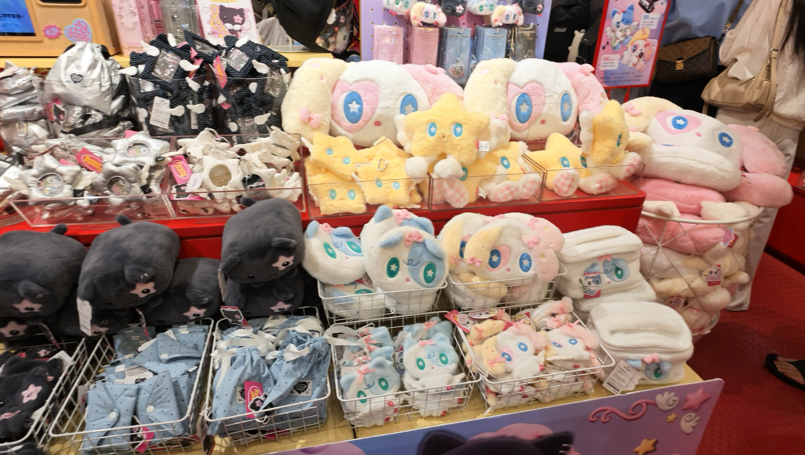

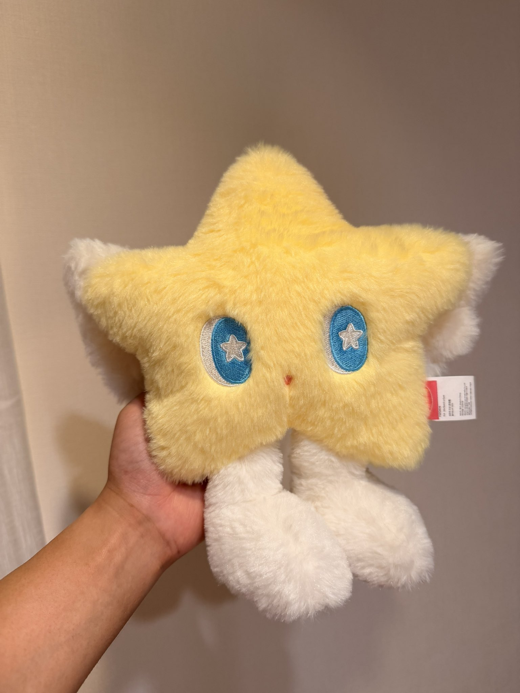

### 弘大のAKプラザへ

そのあとは弘大（ホンデ）へ移動し、AKプラザでアニメイトや無印良品を見て回った。

無印良品には、韓国でしか買えないスナックなどもあった。
キムチの缶詰や麺類のレトルトも気になったが、日本に持ち帰るのが大変そうだと思って、今回は買うのを断念した。

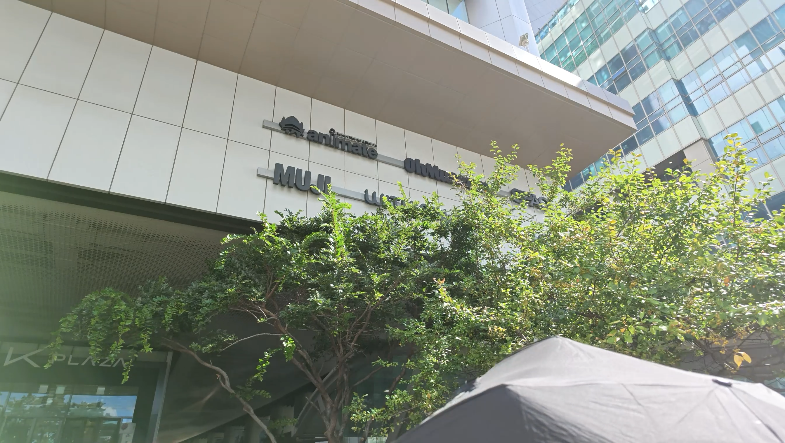

### 仁川のパラダイスシティへ

弘大を見て回ったあとは、仁川にあるパラダイスシティのカジノへ行った。今回も勝った。ギャンブルにお金をかけれない性分なので、こんかいもちまちまと遊んでいた。

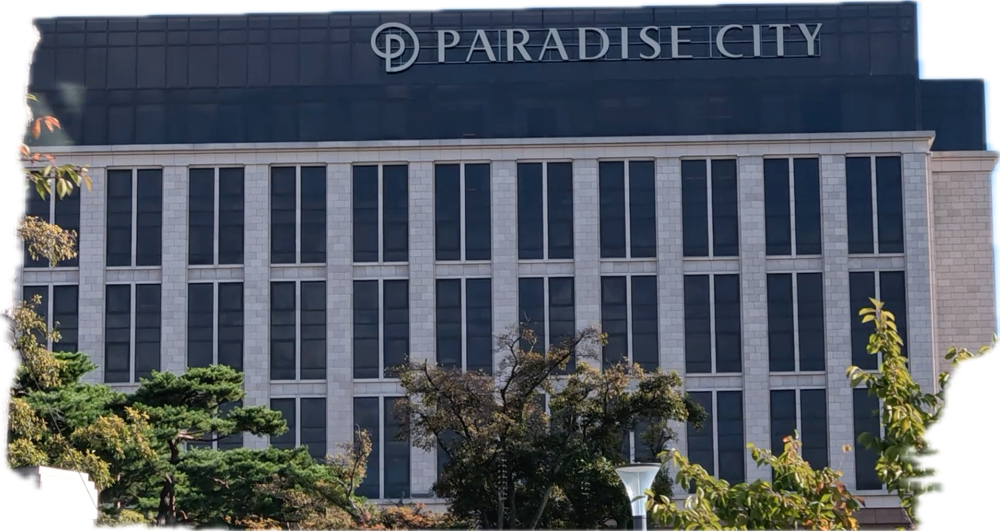

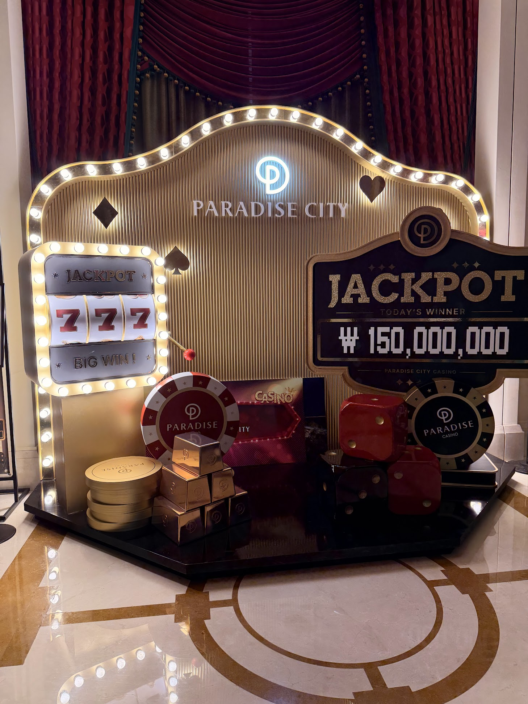

### 最後は仁川空港へ

最後は仁川空港へ移動した。

仁川は保安検査の列が長く、搭乗開始20分前くらいに保安検査を抜れた。仁川は広いし移動にも時間がかかるので早めに行くべきということを学んだ。

帰りの機内食はビーフストロガノフだった。

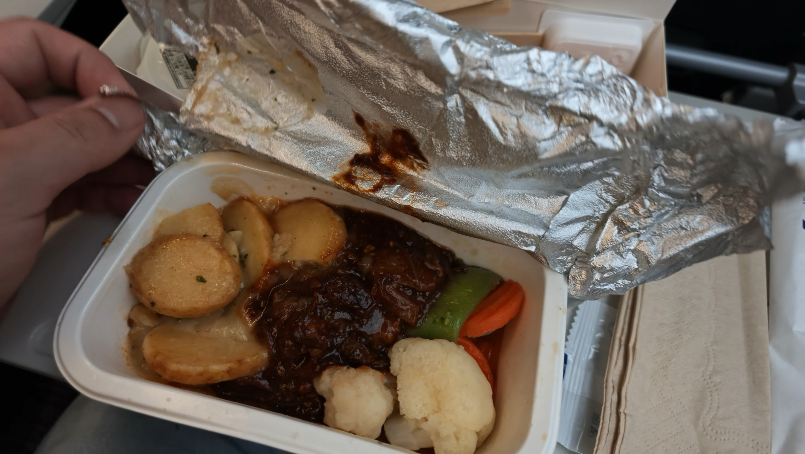

## 買って良かったもの

### LAGOMの洗顔フォーム

前回の韓国旅行から愛用している洗顔フォーム。
日本では[1本2,200円（150mL）](https://lagomcosmetics.jp/products/lg10133)のものが、オリヤンのセールで2本セット約2,600円（120mL×2、22,000ウォン）だった。

### BOHのクリーム

これも大好きな、BOHの3Dリフティングクリーム。
日本では[1個3,300円](https://www.cosme.com/products/detail.php?product_id=364472)のものが、2個セットで約3,500円（30,000ウォン）だった。

### VTのリードルショット300

VTのリードルショット300も1本買った。メガ割よりちょっと安かったくらい。

※円換算は[旅行時のレート](https://jp.investing.com/currencies/krw-jpy-historical-data)でざっくり計算。

## おわりに

今回もよく食べて、よく買い物をした3泊4日だった。  
DMZツアーやNANTAなど、前回とは違う体験もできて楽しかった。  
たまたまオリーブヤングのセールとかぶり様々なセール品を購入できたのも良かった。

オリヤンのセールのたびに、韓国行くのアリだなと思い始めた。