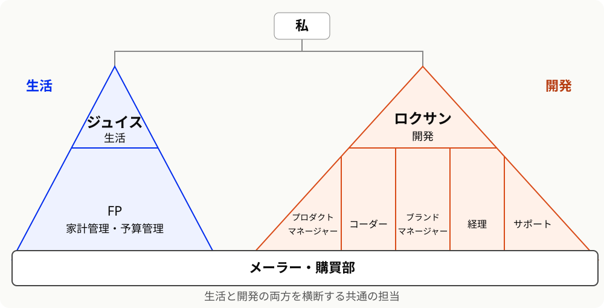

「grokbotってどう使ってるんですか？」とか、友人から「AIって普段どうやって使ってるの？」と聞かれることが増えたので、まとめることにした。

開発のほかにも、家計管理や買い物の相談、メールの振り分けなど、生活のいろんなところで使っている。
名付けて「AI生活実装」。
2026年9月時点では、こんな感じになっている。

## 使っているもの一覧

現在主に使っているのはこんな感じ。

- **Orca / Codex**: 開発用。出先からはOrca Mobileで家のMacにつないで作業
- **grokbot**: 生活と開発のハブ。複数のbot（ロクサン、ジュイスなど）に役割を分散
- **Google AI Pro / Antigravity**: 文章の添削や日常のちょっとした相談
- **Hermes Agent**: ロリポップ！AIエージェントクラウドで常時稼働。毎朝の学習動画やRSS要約の生成

## 開発にはOrcaとCodex

開発にはOrcaを使い、Codexと一緒に作業している。

出先からはOrca Mobileを使って、家のMac上のOrcaにつないでいる。
接続にはロリポップ！ゼロトラストリンクを使っていて、外にいても開発の続きを進められる。接続方法については[こちらの記事](https://zenn.dev/pepabo/articles/orca-lolipop-ztl-mobile)が詳しい。

Claude Codeは仕事で使っているので、個人ではCodexを使っている。
ChatGPT Proは100ドルのプランを契約している。

## grokbotの組織図

grokbotでは、botごとに役割を分けている。
開発側のリーダーが「ロクサン」、生活側のリーダーが「ジュイス」で、その下にそれぞれの担当がいる。

この2つを横断する担当として、メーラーと購買部を置いている。
組織図にするとこんな感じ。

それぞれの担当は、こんな役割を持っている。

| 区分 | 担当 | 役割 |
| --- | --- | --- |
| 生活 | ジュイス | 生活側のまとめ役。相談や情報を受け、関係する担当へ中継する |
| 生活 | FP | 無駄遣いを減らすため、家計管理や予算管理をする |
| 開発 | ロクサン | 開発側のまとめ役。参謀として段取りを組み、生活側も含めて必要な判断をする |
| 開発 | プロダクトマネージャー | 開発の段取りを整え、サポートからの話をコーダーにつなぐ |
| 開発 | コーダー | コードを書く担当 |
| 開発 | ブランドマネージャー | ブランドまわりを担当し、プロダクトマネージャーに情報を共有する |
| 開発 | 経理 | 発生したお金のやり取りを帳簿に付けるのがメイン |
| 開発 | サポート | 問い合わせを受け、開発に関わる話をプロダクトマネージャーへ渡す |
| 横断 | メーラー | メールを読み、購入通知や請求、問い合わせを関係する担当へ振り分ける |
| 横断 | 購買部 | 買い物の相談を受け、FPや経理の意見を聞いてまとめる |

自分からはロクサンにもジュイスにも話しかけている。
ジュイスは生活側の話を中継して、判断が必要になったらロクサンへ回す。
FPや経理など、各担当から判断が必要な話を集める先もロクサンにしている。

### メールを読んで、関係する担当へ回す

メーラーにはメールを読んで、内容に応じて他のbotへ転送してもらっている。
購入明細が届いたらFPや経理へ、請求なら経理へ、問い合わせならサポートへ、という流れ。

サポートに届いた話が開発に関わるものなら、プロダクトマネージャーからコーダーにつながる。

### 買い物は購買部に相談する

何かを買うときは購買部に相談している。
まずFPに、必要なら経理にも意見を聞いて、購買部がまとめてくれる。
実際に買うのは自分。

まあ、相談して「今は買うな」と言われても買うので、あんまり意味はないのだが。

### 毎週リミットに達する

grokbotはCursor Proのプランで使っているが、毎週リミットに達している。
ここはどうにかしたい。

## Google AI Proと文章の添削

Google AI Proも契約している。

[YouTube Premium Liteが付いてくることや、ストレージが増えること](https://one.google.com/about/google-ai-plans/)もあって、お得感がある。
家をGoogle Homeにしたので、そのあたりも相性がいい。

Google Workspaceも導入しているけれど、AIを使うときはGoogle AI Proがメインになっている。

文章の添削にはAntigravityを使っている。
[Gemini 3.8 Flash](https://deepmind.google/models/model-cards/gemini-3-8-flash/)の日本語がいい感じで、気に入っている。

## 毎朝の学習や情報収集はHermes Agent

ロリポップ！AIエージェントクラウドでは、Hermes Agentを使っている。

学習したい内容の動画を毎朝作って送ってもらったり、購読しているRSSの要約を送ってもらったりしている。
毎回自分から頼まなくても届くように、定期実行にしている。

接続しているものについては、[以前の記事](/posts/2026-07-20-hermes-agent-connections)にもまとめている。

## おわりに

書き出してみると、コードを書く以外にも結構使っていた。
家計管理をしてもらったり、朝に学習用の動画が届いたりと、生活の中でAIに任せることが増えている。

使い方も契約するサービスもまた変わると思うので、そのときは改めて書こうと思う。
