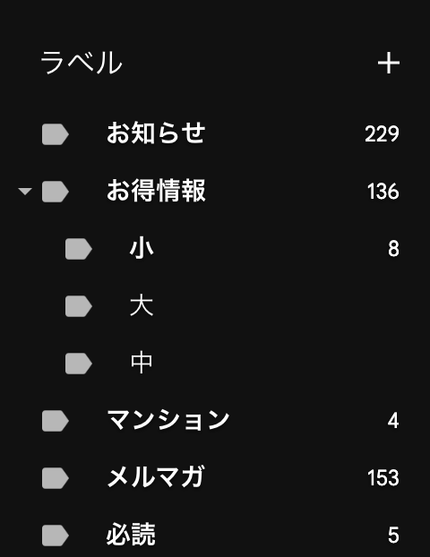

「grokbot ってどう使ってるんですか？」「AI って普段どうやって使ってるの？」と聞かれることが増えたので、まとめることにした。

開発のほかにも、家計管理や買い物の相談、メールの振り分けなど、生活のさまざまなところで使っている。
2026 年 9 月時点では、こんな感じになっている。

## 使っているもの一覧

現在主に使っているのはこんな感じ。

- Orca / Codex
  - 開発用。出先からは Orca Mobile で家の Mac につないで作業
- Grok Bot
  - 生活と開発のハブ。複数の bot（ロクサン、ジュイスなど）に役割を分散
- Google AI Pro / Antigravity
  - 文章の添削や日常のちょっとした相談
- Hermes Agent
  - ロリポップ！AI エージェントクラウドで常時稼働。毎朝の学習動画や RSS 要約の生成

## 開発には Orca と Codex

自分は Orca を使って、Codex と一緒に開発している。

[Orca](https://www.onorca.dev/) は複数の AI エージェントを動かせる開発環境で、[Codex](https://developers.openai.com/) は OpenAI のコーディングエージェントだ。

出先からは Orca Mobile を使って、家の Mac 上の Orca につないでいる。
接続にはロリポップ！ゼロトラストリンクを使っていて、外にいても開発の続きを進められる。
接続方法については[こちらの記事](https://zenn.dev/pepabo/articles/orca-lolipop-ztl-mobile)が詳しい。

Claude Code は仕事で使っているので、個人では Codex を使っている。
ChatGPT Pro は 100 ドルのプランを契約している。

## メールの分類

ChatGPT のスケジュール機能を使って、メールにラベル付けをしてもらっている。
お得情報はレベルに応じて 3 つに分けていて、基本的には「お得情報（大）」しか読まない。
マンションを探しているので、マンション関連のメールだけを個別に分けてもらっている。

実際のラベル分けは次のようになっている。

## Grok Bot の組織図

Cursor Pro についてくる Grok Bot を利用している。

[Grok Bot](https://x.ai/news/introducing-grok-bot) は、クラウド上のコンピューターでアプリを操作して仕事を進めてくれる AI エージェントだ。

Grok Bot では、bot ごとに役割を分けている。
開発側のリーダーが「ロクサン」、生活側のリーダーが「ジュイス」で、その下にそれぞれの担当がいる。

この 2 つを横断する担当として、メーラーと購買部を置いている。
組織図にするとこんな感じ。

それぞれの担当は、こんな役割を持っている。

| 区分 | 担当 | 役割 |
| --- | --- | --- |
| 生活 | ジュイス | 生活側のまとめ役。相談や情報を受け、関係する担当へ中継する |
| 生活 | FP | 無駄遣いを減らすため、家計管理や予算管理をする |
| 開発 | ロクサン | 開発側のまとめ役。参謀として段取りを組み、生活側も含めて必要な判断をする |
| 開発 | プロダクトマネージャー | 開発の段取りを整え、サポートからの話をコーダーにつなぐ |
| 開発 | コーダー | コードを書く担当 |
| 開発 | ブランドマネージャー | ブランドまわりを担当し、プロダクトマネージャーに情報を共有する |
| 開発 | 経理 | 発生したお金のやり取りを帳簿に付けるのがメイン。ドライブに請求書などを保存。スプレッドシートの帳簿を参照・更新する |
| 開発 | サポート | 問い合わせを受け、開発に関わる話をプロダクトマネージャーへ渡す |
| 横断 | メーラー | メールを読み、購入通知や請求、問い合わせを関係する担当へ振り分ける |
| 横断 | 購買部 | 買い物の相談を受け、FP や経理の意見を聞いてまとめる |

自分からはロクサンにもジュイスにも話しかけている。
ジュイスは生活側の話を中継して、判断が必要になったらロクサンへ回す。
FP や経理など、各担当から判断が必要な話を集める先もロクサンにしている。

### メールを読んで、関係する担当へ回す

メーラーにはメールを読んでもらい、内容に応じて他の bot へ転送してもらっている。
- 購入明細が届いたら FP や経理
- 請求なら経理
- 問い合わせならサポート

という流れになっている。

サポートに届いた話が開発に関わるものなら、プロダクトマネージャーからコーダーにつながる。

### 買い物は購買部に相談する

何かを買うときは購買部に相談している。
まず FP に、必要なら経理にも意見を聞いて、購買部がまとめてくれる。

まあ、相談して「今は買うな」と言われても買うので、あんまり意味はないのだが。

### Cursor 自体はあまり使っていない

Cursor Pro を契約しているが、今は Grok Bot の利用がメインになっている。

Cursor の出番は Codex のリミットに達したときや、Anthropic のモデルを使いたいときなど。
iOS アプリを開発するときに、個人的な感想だが Anthropic よりも OpenAI のモデルのほうが素直に実装してくれる気がしている。

## Google AI Pro

Google の Gemini などの AI 機能の利用枠と、ストレージがセットになった有料プランである [Google AI Pro](https://one.google.com/intl/ja_jp/about/google-ai-plans/) に加入している。

YouTube Premium Lite が付いてくることや、Google Drive のストレージが増えること、Google Home から Gemini が使えるということもあり、お得感がある。

## 文章の添削には Antigravity CLI で Gemini 3.8 Flash

ブログなどの文章添削には、Antigravity CLI 経由で [Gemini 3.8 Flash](https://deepmind.google/models/model-cards/gemini-3-8-flash/) を利用している。

Google Workspace にも加入しているが、Gemini は新しいモデルが利用可能になるまで時間がかかるのと、Antigravity の利用枠はついてこない。そのため、新しめのモデルをいち早く使う意味でも Google AI Pro は欠かせない。

## 毎朝の学習や情報収集は Hermes Agent

Hermes Agent をロリポップ！AI エージェントクラウドで動かしている。

[Hermes Agent](https://hermes-agent.nousresearch.com/) は、会話の記憶や作業の定期実行に対応した、オープンソースの AI エージェントだ。

学習したい内容の動画を毎朝作って送ってもらったり、購読している RSS の要約を送ってもらったりしている。
毎回自分から頼まなくても届くように、定期実行にしている。

接続しているものについては、[以前の記事](/posts/2026-07-20-hermes-agent-connections)にもまとめている。

## おわりに

家計管理や帳簿管理を任せられるのは便利だし、できれば管理した結果として今週は良い感じなのか節約すべきなのか、今週使えるお金はこれくらいだということをまとめてもらうことで管理が便利になっている。