## はじめに

2025年の8月ぐらいに海外に行きたいと思い立ち、パスポートを取った。
そして、2026年の3月6日〜3月9日に3泊4日の韓国旅行をした。

## スケジュール
- 3月6日: 20時 羽田空港発 → 22時 金浦空港着 → 23時くらい 明洞にあるホテルにチェックイン、周辺の飲食店で韓国料理を食べる
- 3月7日: 明洞、ソウル駅周辺を散策
- 3月8日: 聖水周辺を散策、梨泰院散策、パラダイスカジノに行く
- 3月9日: 東大門デザインプラザを観光 → 明洞周辺を散策 → 20時 金浦空港発 → 21時30分 羽田空港着

## 20時:初めての国際線
国際線だったので、機内食が出た。ビーフオアチキンと聞かれることもなく親子丼が出てきた。
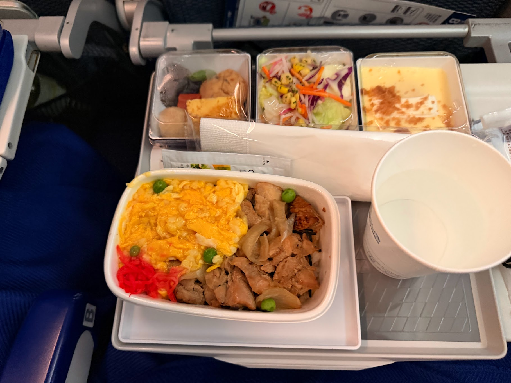

## 1日目

### 22時:空港からホテルへ
空港からは5号線と呼ばれる紫の電車に乗って、ホテル近くの駅まで移動した。

### wowpassが便利
空港最寄りの駅に移動する最中で、wowpass(交通系ICとプリペイドカードのハイブリッド的なカード)にお金をチャージした。

wowpassは日本円でウォンとしてチャージできて、為替レートも優遇されているので今回の旅行では基本wowpassを使うことになった。

機械の故障でwowpassの発行ができないなどのトラブルに遭っている方がいたので、wowpassはQoo10で事前購入して物理カードを持っていくのが良さそうだった。空港近くはwowpassの機械に多くの人が並んでいるので、手数料はかかるがアプリからチャージして、ソウルや明洞などに移動する分だけは事前にチャージしておくとスムーズそうだった。

### 23時:ホテルにチェックイン、周辺散策

[ホテル スカイパーク セントラル 明洞](https://hotels.his-j.com/HotelDetail/SEL00424.aspx)に3泊4日で宿泊した。

日本語が話せるスタッフもいたので良かった。
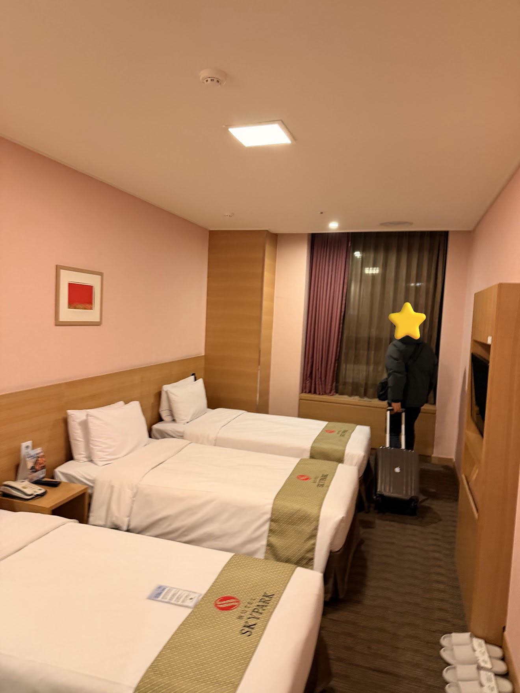

#### 周辺散策
時間が遅かったのでホテル周辺を散策した。

[tanttara Odeng](https://maps.app.goo.gl/JX6VqvftLvHxrMBL9)というお店で、チヂミ[^chijimi]や冷麺などを食べた。

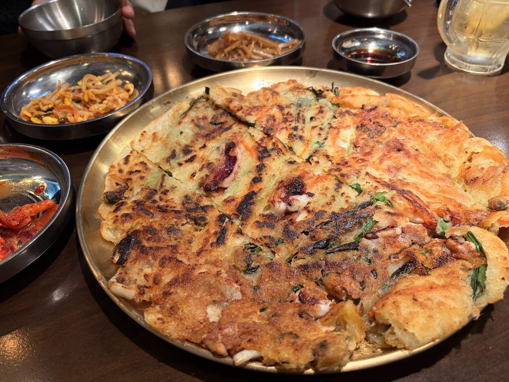

そのあとは、コンビニでヨーグルトなどを買ってホテルに戻った。

## 2日目 明洞ーソウル散策

### 朝ごはんはHOLLYSで
ホテルの朝食はなしにしていたので、歩きながら見つけたカフェHOLLYSで朝ごはんを食べた。

### 明洞からソウル駅へ歩く
そのあとは、明洞のお店を見ながら、南大門を見て、ソウル駅まで散策をした。

ソウル駅では、お昼ご飯に[李陶コムタン ソウル駅直営店](https://www.konest.com/contents/gourmet_mise_detail.html?id=34604)でコムタン[^gomtang]を食べた。

あっさりとして出汁の効いているスープで美味しかった。

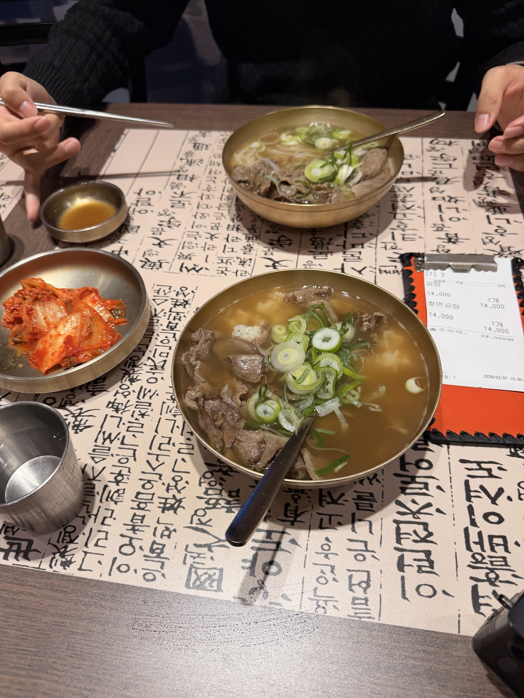
そのあとは、ソウル駅でアパレルなどを見た。
駅地下にあったオリーブヤングで買い物をした。

紙袋がとても可愛かった。
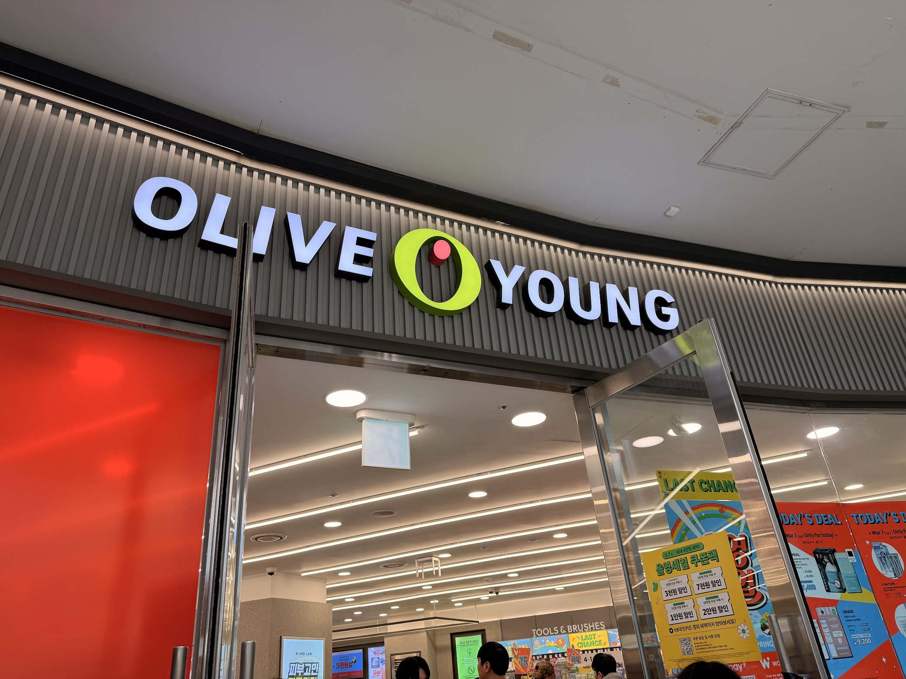
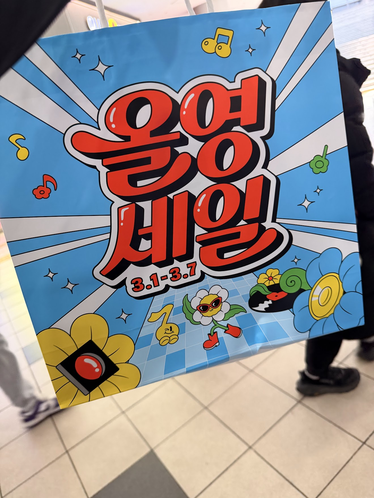

### 明洞
別予定で午前は別行動をしていた友人と明洞で合流して、明洞散策をした。
可愛いキャラクターグッズ、薬局、コスメショップなどを巡り、休憩としてマックで見たことないメニューを買って食べた。

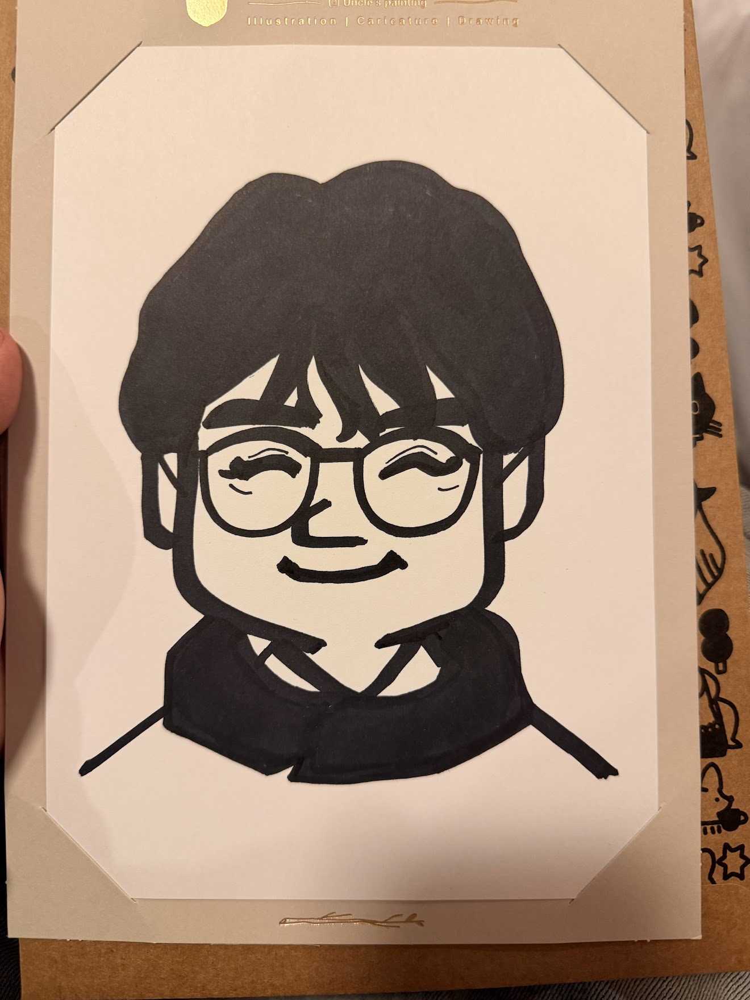
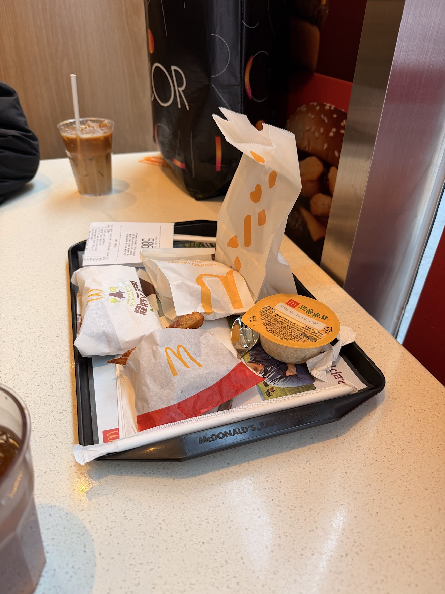

夜ご飯は[王妃家 明洞2号店](https://maps.app.goo.gl/nbsAkUi418JzuCDH8)でサムギョプサル[^samgyeopsal]を食べた。
注文したお肉は全て、店員さんがテーブルで焼いて、切り分けてくれた。キムチやサンチュ[^sangchu]はおかわりできたので、さまざまな食べ方ができた。

ここでの誤算は、マッコリ[^makgeolli]とチャミスル[^chamisul]を頼んだが、マッコリがヤカンで出てきたことだ。
個人的には見たことのないお酒を目の前にして絶望していたが、マッコリもサムギョプサルも美味しかったので、みんなで飲み干した。

結構な量のお肉を食べたが、一人当たり5000円くらいだったので、リーズナブルだった。

その後も、明洞のお店が閉まるまで色々散策をした。

## 3日目 聖水・梨泰院・パラダイスカジノ

### 聖水
monamiストアの文具を買ったり、ポーラアットホームで雑貨を眺めたりとショッピングを楽しんだ。
様々なアパレルショップもあるので、気になったお店には入って服を色々見た。

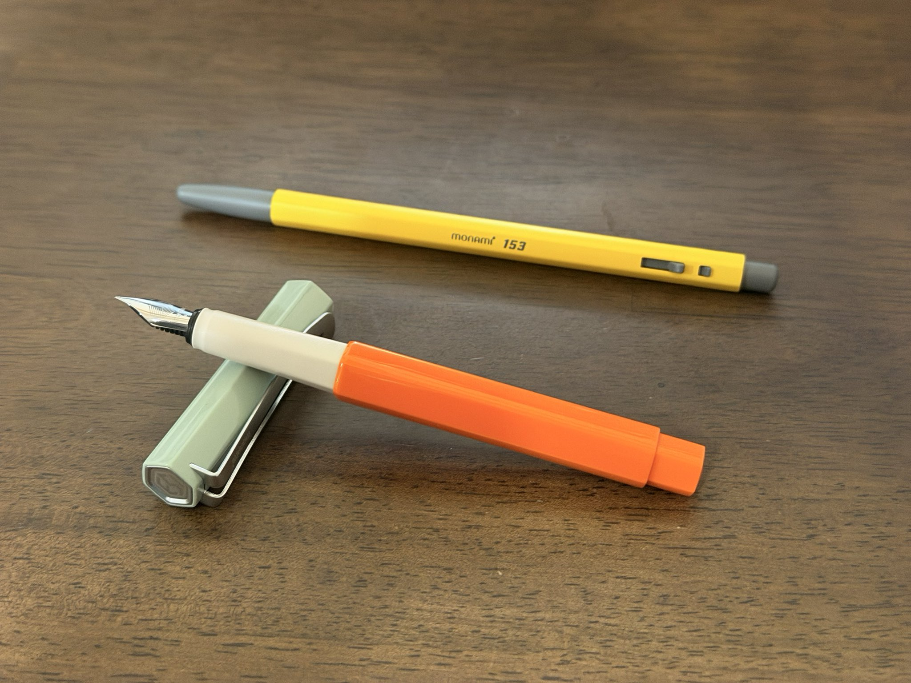

お昼は
[WON-GRANDMA BOSSAM Seongsu store](https://maps.app.goo.gl/pcnFgzbpy2XLhuxf8)
でポッサム[^bossam]を食べた。釜飯のようなご飯はサイドにお湯を注いで雑炊のようにして食べた。
スープは結構な辛さがあったので辛いと言いながら食べていた。

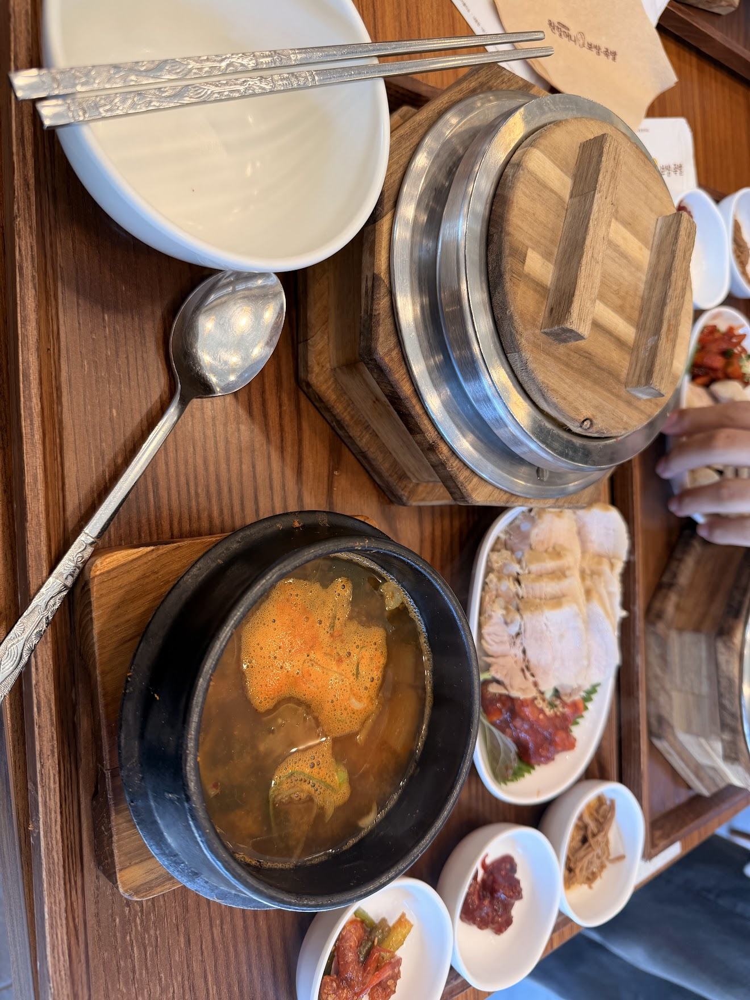

おやつには31でアイスを食べた。
日本にはないフレーバーがあったのと、店内ドリンクもフレーバーティーなどもあり充実していた。
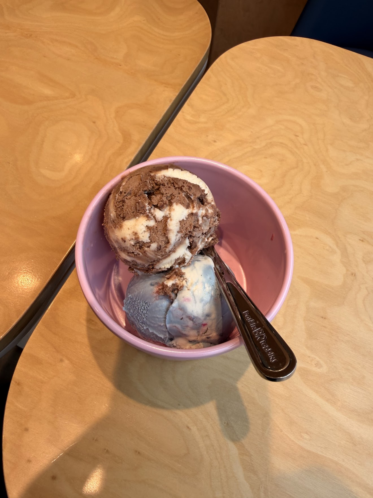

### 梨泰院
友人二人が梨泰院クラスという韓流ドラマを見ていたのでその聖地を訪れた。
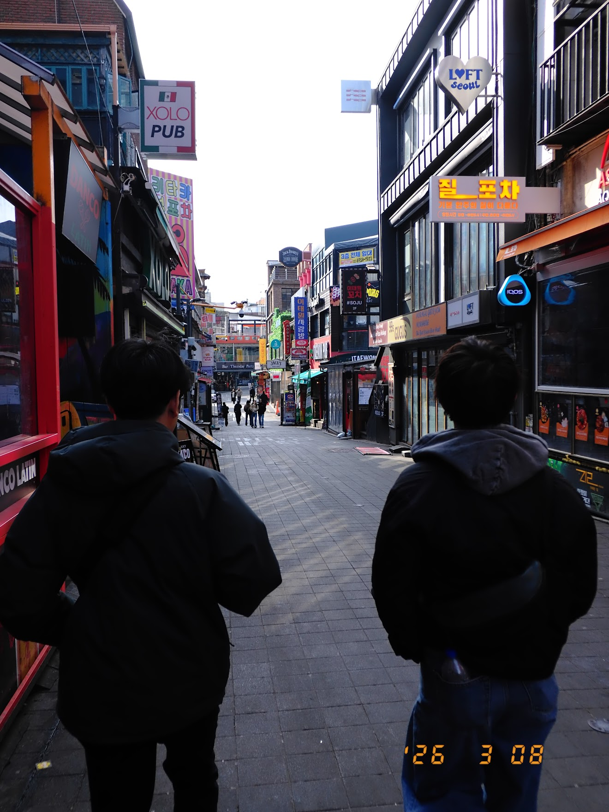

階段や坂が多く起伏の多い街だった。
クラブ街だったが、日曜日の昼だったのであまり人はいなかった。

### パラダイスカジノ
タクシーで移動して、パラダイスカジノに行った。

パスポート見せて入場の受付をしてメンバーカードを発行してもらった。

ルーレットはBlack or Redや奇数偶数などの1/2のものに賭けて遊んだ。

カジノはもっと張り詰めた空気の中でやるようなイメージがあったが、意外とちょっと静かなゲームセンターみたいな感じで
気にせず楽しめた。
スロットでは1,000ウォンが10,000ウォンになったので嬉しかった。

結果としてはプラマイゼロだったと思う(決して、負け惜しみとかではない)。

### 明洞に戻り、海鮮ディナー
[Jogabi Seafood Bar](https://maps.app.goo.gl/ogefWK4E4RVqFPCh9)で海鮮ディナーを食べた。
タコを切ってもまだ動いている状態のタコ、貝の鍋、カンジャンケジャン[^ganjang]などを食べた。

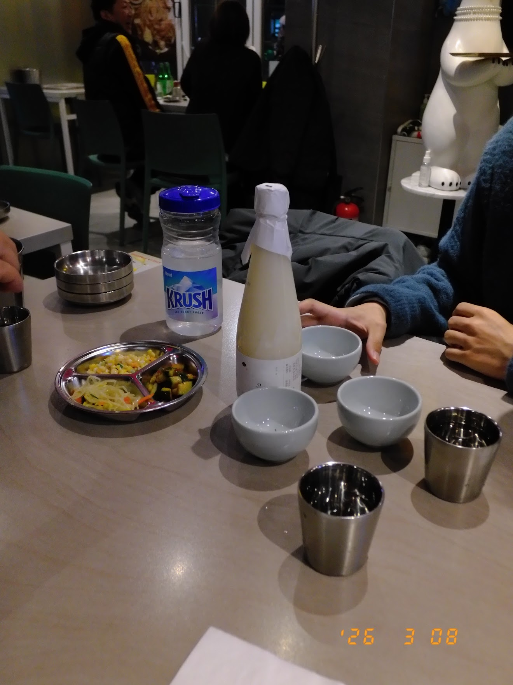

動いているタコは食べると意外と動いてる感じはしなかった。カンジャンケジャンは旨みが詰まった甘い味だった。

## 4日目: 東大門デザインプラザ/最後の明洞散策

### 東大門デザインプラザ(DDP)

建築家のザハ・ハディッドさんが設計した建物で、有機的な曲線のある建物が印象的だった。
ところどころにアート作品が展示されていた。
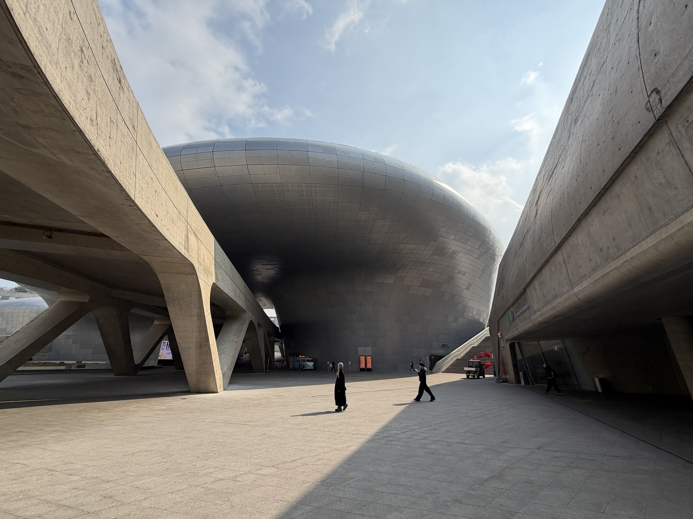
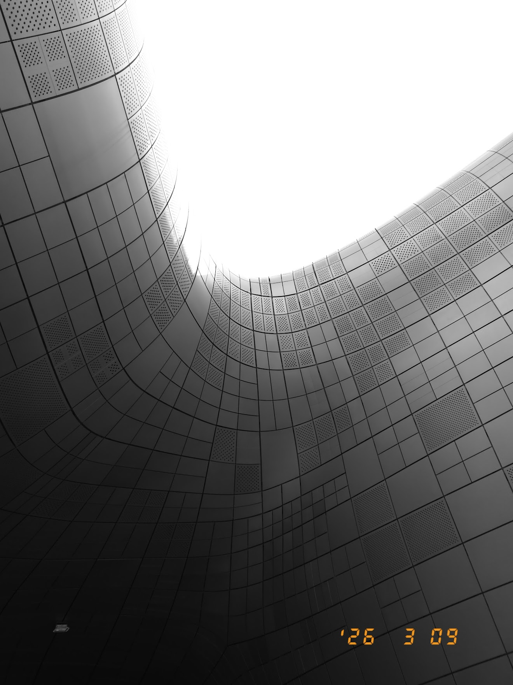

DDPにあるパン屋さんで朝ごはんを食べた。
韓国のパン屋さんはツヤツヤしているパンがなぜか多かった。

買ったら温めて切り分けてくれた。
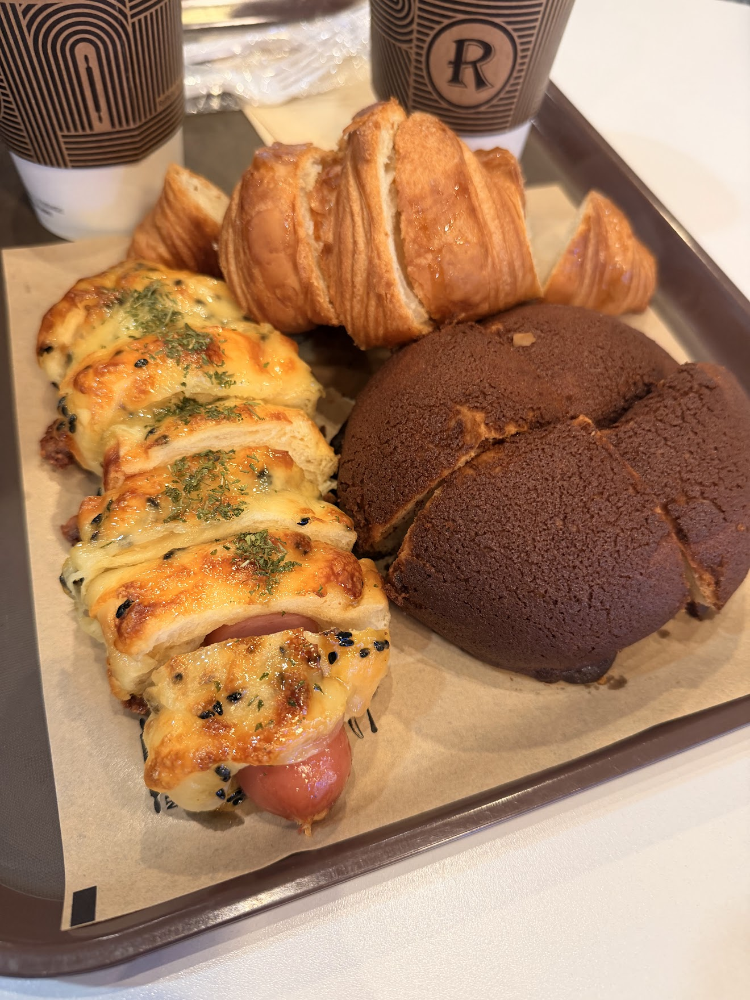

### 明洞で最後の散策
コスメなどは十分に買っていたので最後にアパレルを中心に見て回った。
KODAK CENTER SHOPでKODAKのアパレルを買った。

お昼ご飯は[Premium Jangin Dakalbi](https://maps.app.goo.gl/cSdm4jX1iZbb4Pq16)
でチーズダッカルビ[^dakgalbi]を食べた。
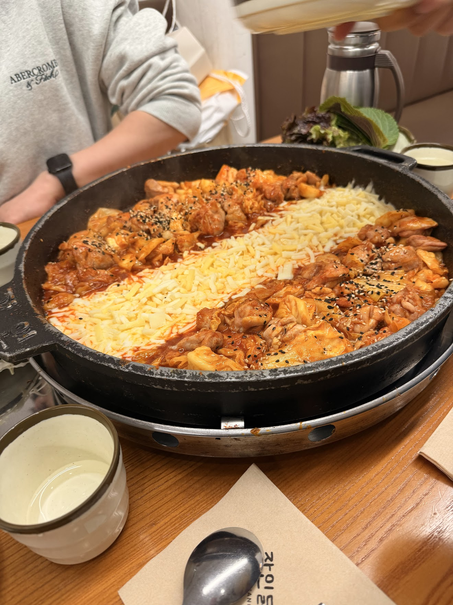

今回の旅行で一番辛かったと思う。もちろん食べれる辛さではあったので、バクバク食べていた。

### さよなら韓国
明洞駅から空港に移動して、帰路に着いた。

空港のお店では、いくつかお土産を買った。
初めてクレカの特典でついてくるプライオリティパスで入れるラウンジを使った。サラダにケーキ、ワイン、ビールなどが食べ飲み放題でよかった。

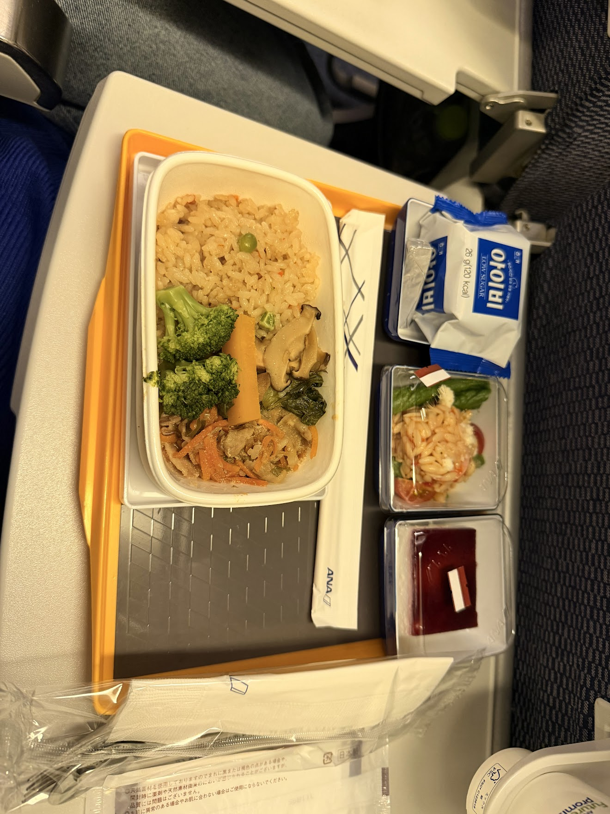

[^chijimi]: チヂミ（전）は、小麦粉の生地に野菜や海鮮を混ぜて薄く焼いた韓国風のお好み焼き。韓国語ではジョン（전）やパジョン（파전）とも呼ばれる
[^gomtang]: コムタン（곰탕）は、牛肉や牛骨を長時間じっくり煮込んで作る韓国の白濁スープ。あっさりした味わいが特徴
[^samgyeopsal]: サムギョプサル（삼겹살）は、豚の三枚肉（バラ肉）を厚切りにして焼く韓国式焼肉。「三層肉」の意味
[^sangchu]: サンチュ（상추）は、焼肉を包んで食べるための韓国のレタスの一種
[^makgeolli]: マッコリ（막걸리）は、米を発酵させて作る韓国の伝統的な乳白色の濁り酒
[^chamisul]: チャミスル（참이슬）は、韓国の焼酎ブランド。「眞露（JINRO）」が製造する韓国で最もポピュラーな焼酎
[^bossam]: ポッサム（보쌈）は、茹でた豚肉をキムチやサンチュなどの野菜で巻いて食べる韓国料理
[^ganjang]: カンジャンケジャン（간장게장）は、生のワタリガニを醤油ベースのタレに漬け込んだ韓国料理。「ご飯泥棒」とも呼ばれるほどご飯が進む
[^dakgalbi]: ダッカルビ（닭갈비）は、鶏肉と野菜をコチュジャンベースの甘辛いソースで炒めた韓国料理。チーズをのせたものがチーズダッカルビ
